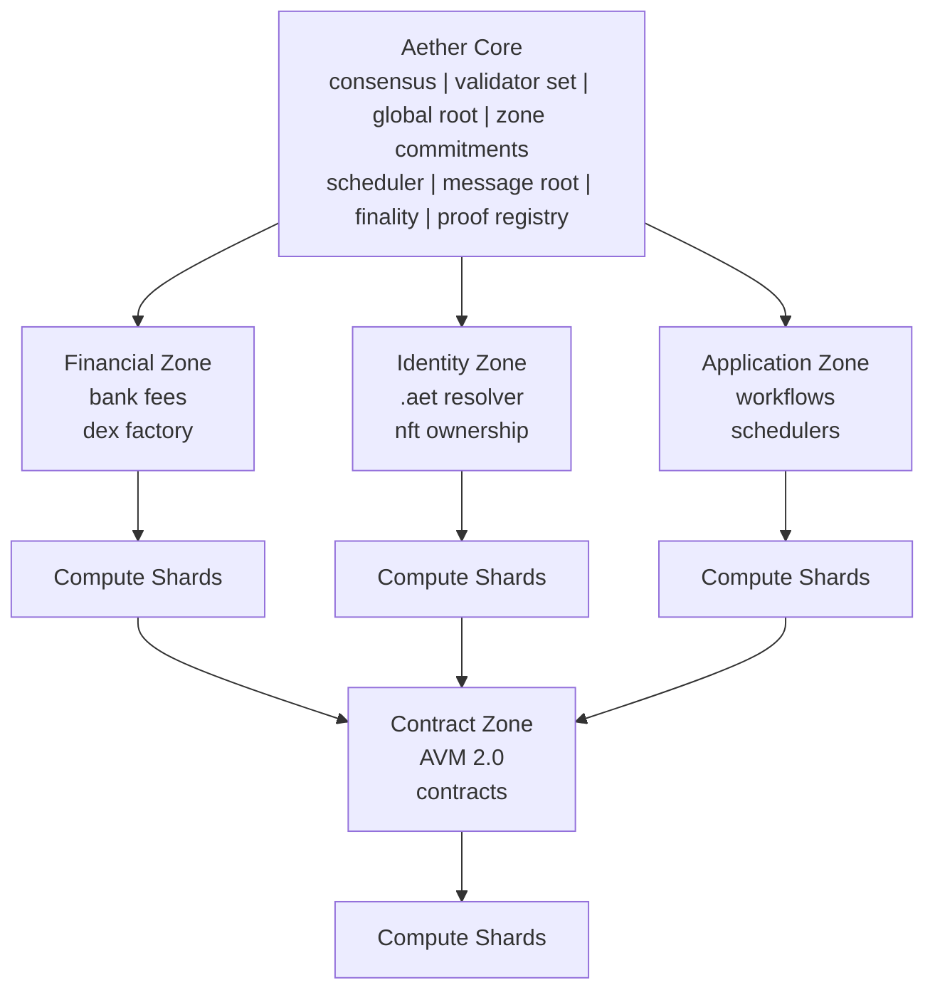
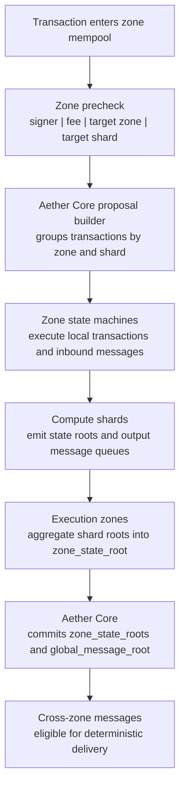
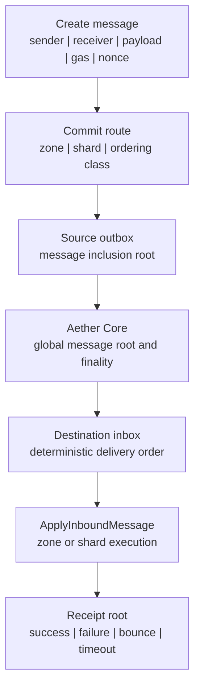
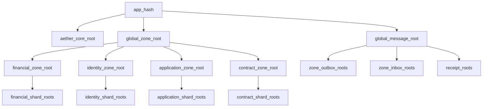

# Aetheris Next-Generation Blockchain Architecture

Status: Internal design document
Scope: Multi-zone, sharded, message-driven Aetheris architecture
Visibility: Private, not for public repository inclusion

## 1. Architecture Design

### 1.1 Target System

Aetheris Next extends the current single-chain Cosmos SDK runtime into a modular execution system with:

- Aether Core for consensus, validator set, global ordering, and commitments.
- Execution Zones for isolated state machines.
- Compute Shards for dynamic state partitioning inside each zone.
- A unified message layer for account, shard, and zone communication.
- AVM 2.0 for deterministic contract execution.
- Universal proof commitments for account, message, zone, identity, and resolver state.
- Native `.aet` identity resolution across zones.
- Native payment routing and settlement across zones and shards.

### 1.2 Primary Constraints

- Base implementation must remain buildable in Go with Cosmos SDK `v0.54+`.
- CometBFT remains the BFT finality layer.
- ABCI++ and `FinalizeBlock` remain the block execution boundary.
- BlockSTM is used for parallel transaction execution where state conflicts are known.
- Store v2 is used for high-throughput state access and proof generation.
- All state transitions must be deterministic.
- No consensus path may call external APIs.
- Dynamic shard changes must be reproducible from committed state.
- Routing decisions used for consensus execution must be deterministic or proof-backed.

### 1.3 High-Level Component Diagram



### 1.4 Execution Flow



### 1.5 Execution Guarantees

- Same-zone same-shard operations execute with local ordering.
- Same-zone cross-shard operations use asynchronous messages.
- Cross-zone operations use asynchronous messages and proof-backed receipt state.
- Contracts cannot synchronously read arbitrary remote zone state.
- Remote state access requires proof input or committed message response.
- Every output message has an inclusion commitment.
- Every consumed message has a receipt commitment.

## 2. Aether Core

### 2.1 Responsibilities

Aether Core is the deterministic coordination layer. It owns global ordering and commitments, but it does not execute or store zone-local application state.

| Owned by Aether Core | Boundary |
| --- | --- |
| Validator set and consensus configuration | Defines finality and validator authority for the whole network. |
| Global block execution boundary | Keeps ABCI++ `FinalizeBlock` as the consensus execution boundary. |
| Zone registry | Records enabled zones, versions, capabilities, and upgrade metadata. |
| Zone scheduling | Orders zone and shard workloads using deterministic proposal grouping. |
| Zone state commitments | Commits each zone root without owning zone-local state. |
| Message root commitments | Commits inbox, outbox, delivery, and receipt roots. |
| Cross-zone finality ordering | Makes cross-zone messages eligible only after committed ordering. |
| Proof root registry | Publishes account, message, zone, identity, resolver, payment, and VM proof roots. |
| Global fee accounting | Tracks network-level fee settlement and accounting roots. |
| Upgrade and migration coordination | Coordinates version gates, layout migrations, and replay-safe transitions. |

| Not owned by Aether Core | Reason |
| --- | --- |
| Zone-local application state | Zones remain isolated state machines under their own prefixes. |
| Zone-specific contract storage | Contract state belongs to the contract zone and its shards. |
| Zone-specific mempool policy beyond global validity bounds | Zones can tune local admission while Aether Core enforces deterministic bounds. |
| Non-deterministic route selection | Consensus routing must be deterministic or backed by committed proof input. |

### 2.2 Core State

Core state is append-friendly and replayable. Historical commitments remain addressable by height or epoch so another node can rebuild the same global root from committed state.

| Key | Value | Purpose |
| --- | --- | --- |
| `core/zones/{zone_id}` | `ZoneDescriptor` | Registered zone metadata, capabilities, and version gates. |
| `core/zone_roots/{height}/{zone_id}` | `ZoneCommitment` | Per-height state, message, receipt, event, and shard root commitment for a zone. |
| `core/message_roots/{height}` | `GlobalMessageRoot` | Global inbox and outbox commitment used for deterministic delivery eligibility. |
| `core/shard_layouts/{zone_id}/{layout_epoch}` | `ShardLayout` | Reproducible shard topology for a zone at a committed layout epoch. |
| `core/routing_table/{routing_epoch}` | `RoutingTableCommitment` | Deterministic mapping from zones and actors to active shard layouts. |
| `core/proof_roots/{height}/{root_type}` | `ProofRoot` | Universal proof registry for state, account, message, zone, identity, resolver, payment, and VM roots. |
| `core/finality/{height}` | `FinalityRecord` | Final app hash, global roots, and cross-zone delivery finality metadata. |
| `core/params` | `CoreParams` | Global limits and feature gates for deterministic execution. |

### 2.3 ZoneDescriptor

`ZoneDescriptor` is the registry record that lets Aether Core schedule a zone without owning that zone's application state.

| Field | Type | Consensus meaning |
| --- | --- | --- |
| `zone_id` | `ZoneID` | Canonical zone identifier used in routing, commitments, and proof keys. |
| `zone_type` | `ZoneType` | Execution class such as financial, identity, application, contract, or service. |
| `module_name` | `string` | Cosmos SDK module or zone adapter that executes the state machine. |
| `enabled` | `bool` | Disabled zones cannot receive scheduled work or new routing entries. |
| `state_machine_version` | `uint64` | Version gate for replay-safe execution and migrations. |
| `mempool_policy_id` | `string` | Zone admission policy identifier, bounded by global validity rules. |
| `fee_policy_id` | `string` | Fee accounting policy; native execution uses `naet`. |
| `shard_layout_epoch` | `uint64` | Current committed shard layout epoch for deterministic routing. |
| `max_shards` | `uint32` | Upper bound for active compute shards in the zone. |
| `message_capabilities` | `[]string` | Supported inbox, outbox, local, routed, and receipt message modes. |
| `proof_capabilities` | `[]string` | Supported proof surfaces such as account, message, receipt, identity, resolver, and state. |
| `upgrade_height_optional` | `uint64` | Optional activation height for versioned zone migration. |

### 2.4 ZoneCommitment

`ZoneCommitment` is the per-height output that Aether Core commits after a zone finishes deterministic execution.

| Field | Type | Consensus meaning |
| --- | --- | --- |
| `height` | `uint64` | Block height for the commitment. |
| `zone_id` | `ZoneID` | Zone that produced the commitment. |
| `zone_state_root` | `Hash` | Root of the zone-local state after execution. |
| `zone_message_outbox_root` | `Hash` | Commitment to messages emitted by the zone. |
| `zone_message_inbox_root` | `Hash` | Commitment to consumed inbound messages. |
| `zone_receipt_root` | `Hash` | Commitment to execution and delivery receipts. |
| `zone_event_root` | `Hash` | Commitment to deterministic events emitted by zone execution. |
| `shard_roots_root` | `Hash` | Aggregate root of active shard state roots. |
| `execution_summary_hash` | `Hash` | Hash of counts, gas, receipts, messages, and events for replay checks. |

### 2.5 Core Execution Pipeline

ABCI++ remains the execution boundary. Each phase has deterministic inputs, explicit rejection rules, and committed outputs.

| Phase | Deterministic work | Rejection checks | Output |
| --- | --- | --- | --- |
| `PrepareProposal` | Group transactions by `zone_id` and `shard_id`; apply size and gas bounds; prefer disjoint shard workloads for BlockSTM; include pending inbound messages by deterministic priority. | Exclude malformed transactions, disabled zones, invalid shard targets, and batches above proposal limits. | Canonical proposal schedule with local transactions and inbound message batches. |
| `ProcessProposal` | Rebuild the expected schedule from proposal contents and committed routing state. | Reject invalid grouping, disabled zones, missing shard layouts, wrong message delivery order, or malformed execution batches. | Accepted proposal schedule or deterministic rejection. |
| `FinalizeBlock` | Execute zone batches, execute inbound messages, collect outboxes, compute shard roots, compute zone roots, and aggregate global roots. | Reject non-deterministic execution outputs, root mismatches, duplicate receipts, and invalid proof roots. | `ZoneCommitment`, `GlobalMessageRoot`, receipt roots, proof roots, and global state root. |
| `Commit` | Persist final app hash and root snapshots; expose next-height delivery queues. | Reject missing finality metadata or mismatched app hash commitments. | Committed app hash, historical proof roots, and delivery eligibility for the next height. |

### 2.6 Core Implementation Tasks

Core implementation work should land as small deterministic primitives first, then keeper integration, then replay tests.

| Priority | Task | Target | Acceptance criteria |
| --- | --- | --- | --- |
| P0 | Zone registry | `x/aethercore` keeper and types | Register, update, disable, export, and validate `ZoneDescriptor` records with canonical ordering and version gates. |
| P0 | Zone descriptor and upgrade metadata | `ZoneDescriptor` validation | Reject duplicate zones, disabled scheduling targets, invalid state-machine versions, and non-native fee policy for consensus execution. |
| P0 | Zone commitment aggregation | `ZoneCommitment`, `GlobalStateRoot` | Build deterministic zone commitment roots from per-zone state, inbox, outbox, receipt, event, shard, params, and execution summary hashes. |
| P0 | Global message root construction | `GlobalMessageRoot` | Commit inbox and outbox roots by height and expose them as proof roots for deterministic cross-zone delivery. |
| P0 | Proposal grouping by zone and shard | `ProposalSchedule` | Build canonical `PrepareProposal` schedules sorted by zone, shard, priority, admission height, transaction hash, and message index. |
| P0 | Deterministic inbound message scheduler | kernel message pipeline | Deliver pending inbound messages by committed priority and reject batches with missing, duplicate, expired, or reordered messages. |
| P0 | Proof root registry | `ProofRoot`, root snapshots | Commit state, account, message, zone, identity, resolver, payment, VM, routing, and shard-layout roots at each finalized height. |
| P1 | Root consistency invariants | `x/aethercore` invariants | Assert zone roots, message roots, receipt roots, routing table roots, and shard layout roots match the committed global root. |
| P1 | Block replay tests | `x/aethercore` tests | Rebuild the same state from differently ordered inputs and require identical zone commitments, proof roots, and global app hash. |
| P1 | Keeper integration | `x/aethercore/keeper` | Persist descriptors, layouts, routing tables, commitments, root snapshots, and finality records through Cosmos SDK stores. |
| P2 | Operational export/import | state export manifest | Export committed roots, descriptors, layouts, routing epochs, and manifests for reproducible node bootstrap and audits. |

## 3. Execution Zones

### 3.1 Zone Model

An Execution Zone is an isolated Cosmos SDK state machine. It owns local execution and state, while Aether Core owns scheduling, commitments, and global finality.

| Zone-owned surface | Requirement |
| --- | --- |
| Module keeper set | Zone modules execute behind a zone adapter and cannot mutate another zone directly. |
| State prefix | All keys live under a zone-owned prefix and remain exportable for replay. |
| Mempool policy | Zone admission rules are allowed, but global validity bounds still apply. |
| Shard layout | Active shards are committed by layout epoch and selected by deterministic routing. |
| Message inbox and outbox | Cross-zone and cross-shard effects flow through committed message queues. |
| Fee policy | Zone-local accounting can be specialized while global settlement remains committed by Aether Core. |
| Proof root | Each zone emits state, message, receipt, event, and domain-specific proof roots. |
| Execution metrics | Gas, message counts, receipt counts, failures, and shard outputs feed `ZoneExecutionSummary`. |

Zone state must be deterministic and isolated by prefix. Cross-zone interaction occurs only through messages, proofs, and Aether Core commitments.

### 3.2 Required Zones

#### 3.2.1 Financial Zone

The Financial Zone owns native value movement, fee accounting, tokenfactory state, DEX state, and payment settlement collateral.

| Area | Responsibilities |
| --- | --- |
| Scope | `bank`, `fees`, `tokenfactory`, `dex`, fee distribution hooks, payment settlement hooks. |
| Primary state | Balances, denom metadata, tokenfactory authority records, liquidity pools, fee buckets, payment settlement collateral. |
| Shard keys | Account address for balances; denom and pool ID for token and DEX state; payment channel ID for settlement state. |
| Proof roots | Balance root, denom root, tokenfactory authority root, pool root, fee accumulator root, payment collateral root. |

| Priority | Implementation task | Acceptance criteria |
| --- | --- | --- |
| P0 | Move financial hot paths under `zone/financial/*` prefixes. | Balance, fee, tokenfactory, DEX, and collateral keys are prefix-isolated and exportable by zone. |
| P0 | Add account-address shard routing. | Balance reads and writes route to the same shard for a given account address hash. |
| P0 | Add pool-ID shard routing for DEX operations. | Pool state, swap accounting, and liquidity mutations route by committed pool ID. |
| P0 | Add cross-shard transfer via message escrow. | Sender shard debits into escrow, receiver shard credits from a committed receipt, and failures refund deterministically. |
| P1 | Add per-shard fee accumulator and end-block aggregation. | Shard fee buckets aggregate into a zone fee root before Aether Core commits the global state root. |

#### 3.2.2 Identity Zone

The Identity Zone is the native `.aet` authority. It resolves names, reverse records, ownership proofs, and resolver state for other zones through committed messages and proofs.

| Area | Responsibilities |
| --- | --- |
| Scope | `.aet` registry, resolver records, reverse records, NFT-backed ownership, delegation and grants, auctions, identity proof queries. |
| Primary state | Domain records, resolver records, NFT bindings, reverse records, delegation records, auction records. |
| Shard keys | `name_hash` for domain and resolver state; address hash for reverse records; auction ID for auction state. |
| Proof roots | Identity root, resolver root, reverse lookup root, ownership binding root, auction root. |

| Priority | Implementation task | Acceptance criteria |
| --- | --- | --- |
| P0 | Activate `x/identity v2` as a zone state machine. | Zone descriptor exposes identity capabilities and commits deterministic domain, resolver, reverse, and delegation roots. |
| P0 | Add resolver state roots to proof registry. | `.aet` resolver proofs are available through Aether Core `ProofRoot` at each finalized height. |
| P0 | Add cross-zone identity lookup message. | Other zones can request identity resolution through asynchronous messages without synchronous remote reads. |
| P1 | Add proof-backed reverse lookup. | Reverse lookup responses include committed address-hash proof input and replay-safe receipts. |
| P1 | Add Store v2 key layout optimized for `name_hash`. | Domain and resolver scans are prefix-local, shard-routable, and reproducible from committed layout state. |

#### 3.2.3 Application Zone

The Application Zone hosts workflow and scheduler state that does not belong in Aether Core. It coordinates application modules while keeping execution bounded and message-driven.

| Area | Responsibilities |
| --- | --- |
| Scope | Workflows, schedulers, app-specific module execution, async jobs, service coordination. |
| Primary state | App instances, scheduled tasks, workflow state, app message queues, service permissions. |
| Shard keys | App ID, workflow ID, scheduler bucket. |
| Proof roots | App state root, workflow root, scheduler root, app queue root, service permission root. |

| Priority | Implementation task | Acceptance criteria |
| --- | --- | --- |
| P0 | Define app runtime boundaries. | Application execution cannot mutate Aether Core state directly and must use zone messages for cross-zone effects. |
| P0 | Add deterministic scheduler queues. | Scheduler ordering is derived from committed bucket, due height, priority, and task ID. |
| P0 | Add app-level async message output. | Workflows emit committed outbox messages with receipts and retry-safe identifiers. |
| P1 | Add bounded execution per block. | Per-app gas, task count, and queue drain limits are enforced before `FinalizeBlock` output commitment. |
| P1 | Add app proof roots. | App, workflow, scheduler, queue, and permission roots are registered in the proof registry. |

#### 3.2.4 Contract Zone

The Contract Zone owns AVM 2.0 execution and contract state. Contracts interact with other zones through asynchronous messages and proof-backed responses, not synchronous remote state reads.

| Area | Responsibilities |
| --- | --- |
| Scope | AVM 2.0 runtime, contract storage, contract accounts, contract code registry, contract message inbox and outbox. |
| Primary state | Contract code, contract instances, contract storage, ABI descriptors, gas tables, contract event logs. |
| Shard keys | Contract address for instance state; storage key prefix for storage partitions; code ID for code registry. |
| Proof roots | Contract code root, instance root, storage root, ABI root, gas table root, event root, contract inbox/outbox roots. |

| Priority | Implementation task | Acceptance criteria |
| --- | --- | --- |
| P0 | Implement AVM 2.0 execution keeper. | Contract execution is deterministic, metered, replayable, and bounded by zone gas limits. |
| P0 | Add contract state sharding by contract address. | Contract instance reads and writes route to the committed shard for the contract address. |
| P0 | Add async contract call messages. | Cross-contract and cross-zone calls emit committed inbox/outbox messages with receipts and retry-safe call IDs. |
| P1 | Add contract proof APIs. | Code, instance, storage, ABI, event, inbox, and outbox proofs are queryable from committed proof roots. |
| P1 | Add gas metering per instruction. | AVM instruction costs are versioned, deterministic, and included in `ZoneExecutionSummary`. |

### 3.3 Zone Execution Requirements

Every zone implements the same adapter contract so Aether Core can schedule execution without knowing zone-local state internals.

| Requirement | Purpose | Failure mode |
| --- | --- | --- |
| `ExecuteZoneBatch` | Executes local transactions for one zone and one committed shard grouping. | Reject the batch if routing, gas, signer, or state access rules are invalid. |
| `ApplyInboundMessage` | Applies committed cross-zone or cross-shard messages from the inbox. | Reject missing, duplicate, expired, reordered, or malformed messages. |
| `ZoneExecutionSummary` | Emits deterministic counts, gas usage, message roots, receipt roots, event roots, and summary hash. | Reject if computed summary differs from committed execution outputs. |
| `zone_state_root` | Commits the zone-local state after local transactions and inbound messages. | Reject if shard roots or state writes do not reproduce the same root. |
| Inbox, outbox, receipt, and event roots | Provide inclusion proofs for consumed messages, emitted messages, receipts, and deterministic events. | Reject if any root is missing, malformed, or inconsistent with the execution summary. |
| Deterministic export and import | Allows replay, migration, audit, and node bootstrap from committed state. | Reject imports that do not reproduce descriptor, layout, commitment, and proof roots. |

### 3.4 ZoneExecutionSummary

`ZoneExecutionSummary` is the compact replay record that binds a zone's execution outputs to its `ZoneCommitment`.

| Field | Type | Consensus meaning |
| --- | --- | --- |
| `height` | `uint64` | Block height for the execution summary. |
| `zone_id` | `ZoneID` | Zone that executed the batch. |
| `tx_count` | `uint64` | Number of local transactions included in the zone batch. |
| `inbound_message_count` | `uint64` | Number of committed inbound messages applied by the zone. |
| `outbound_message_count` | `uint64` | Number of messages emitted to shard-local or cross-zone outboxes. |
| `gas_used` | `uint64` | Total deterministic gas consumed by local transactions and inbound messages. |
| `state_writes` | `uint64` | Count or metered weight of committed state writes. |
| `state_reads` | `uint64` | Count or metered weight of deterministic state reads. |
| `shards_touched` | `uint32` | Number of active shards touched by the executed batch. |
| `failed_messages` | `uint64` | Number of inbound or emitted messages that produced failure receipts. |
| `zone_state_root` | `Hash` | Zone-local state root after execution. |
| `outbox_root` | `Hash` | Commitment to emitted outbound messages. |
| `receipt_root` | `Hash` | Commitment to local transaction and message execution receipts. |

## 4. Compute Shards

### 4.1 Shard Model

A Compute Shard is a deterministic state partition inside a zone. It narrows the read/write set for parallel execution while preserving one canonical zone root.

| Shard property | Requirement |
| --- | --- |
| Identity | Each shard is identified by `(zone_id, shard_id)` and belongs to exactly one committed `ShardLayout`. |
| Key ownership | A shard owns a deterministic key range, hash range, or explicit placement set. |
| Execution | A shard executes local transactions and inbound messages assigned by the committed routing table. |
| State root | A shard produces `shard_state_root`, which is aggregated into `shard_roots_root` and then `zone_state_root`. |
| Message outbox | A shard emits output messages to a shard-local outbox before zone-level aggregation. |
| Metrics | A shard maintains local gas, fee, queue, conflict, state-size, and proof-latency counters. |

### 4.2 Shard Assignment

Shard assignment is deterministic and based only on committed state. The same routing input must produce the same shard on every node.

| Assignment mode | Use case | Rule |
| --- | --- | --- |
| Deterministic key prefixing | Module-owned state with clear prefixes. | Map known prefixes to configured shard ranges in `ShardLayout`. |
| Consistent hashing | High-cardinality account, domain, payment, and contract state. | Hash the canonical state key with the layout epoch and modulo the active shard count. |
| Explicit object placement | Global parameters, zone metadata, singleton state, and special objects. | Use a committed placement override or route to the system shard. |

| Recommendation | State classes |
| --- | --- |
| Deterministic key prefixing | Module-owned state, fee buckets, metadata prefixes, queue prefixes. |
| Consistent hashing | Account balances, `.aet` names, contract addresses, payment channels, workflow instances. |
| Explicit placement | Global parameters, zone descriptors, routing metadata, migration markers, read-only replicated cache entries. |

Shard routing function:

```text
shard_id = RouteKeyToShard(zone_id, state_key, shard_layout_epoch)
```

| Input | Description |
| --- | --- |
| `zone_id` | Zone that owns the state key. |
| `state_key` | Canonical state key after prefix normalization. |
| `shard_layout_epoch` | Committed layout epoch used for routing. |
| `assignment_mode` | Prefix, hash, or explicit placement mode from `ShardLayout`. |
| `shard_count` | Active shard count for the zone at the layout epoch. |
| `placement_override` | Optional committed override for singleton or special state. |

| Rule | Consensus effect |
| --- | --- |
| Same input produces the same shard on every node. | Prevents route-dependent state divergence. |
| Routing uses committed `ShardLayout`. | Proposal builders and validators derive the same shard assignment. |
| Layout changes take effect only at epoch boundary. | Prevents mid-block route changes and replay ambiguity. |
| Global state keys route to system shard or replicated read-only cache. | Keeps singleton state deterministic while allowing fast reads. |

### 4.3 Shard Split and Merge

Shard layout changes are deterministic governance or protocol decisions derived from committed shard metrics. They never change routing mid-block.

| Split trigger | Source metric | Expected action |
| --- | --- | --- |
| Sustained gas utilization above threshold | `ShardMetrics.gas_used` and gas limit window. | Schedule a future layout epoch with additional shard capacity. |
| State size above threshold | Committed state-size counter or Store v2 size estimate. | Split key ranges or hash ranges into smaller ownership partitions. |
| Write conflict rate above threshold | BlockSTM conflict counter. | Separate hot key ranges or actors into disjoint shards. |
| Queue backlog above threshold | Shard-local inbox and outbox backlog metrics. | Increase shard parallelism or isolate busy message routes. |
| Proof generation latency above threshold | Proof latency histogram committed as shard metric. | Reduce proof range size by splitting the shard. |

| Merge trigger | Source metric | Expected action |
| --- | --- | --- |
| Sustained low utilization | Gas and transaction utilization window. | Merge adjacent low-load shards at the next layout epoch. |
| Low state size | State-size counter below merge threshold. | Combine key ranges without exceeding target proof size. |
| Low queue backlog | Inbox and outbox backlog below merge threshold. | Consolidate delivery queues while preserving message order. |
| Low conflict rate | BlockSTM conflict counter below merge threshold. | Merge shards when parallelism no longer improves throughput. |

| Rule | Consensus effect |
| --- | --- |
| Decisions are computed from committed metrics. | Every node derives or verifies the same split or merge decision. |
| Decisions are scheduled for a future `layout_epoch`. | Current-height execution and routing remain stable. |
| State movement is represented by deterministic migration tasks. | Export, import, replay, and proof generation can reproduce the transition. |
| Messages in transit keep original source metadata and route by delivery epoch. | Delivery remains valid when source and destination layouts change. |
| No split or merge may occur mid-block. | Prevents route ambiguity inside `FinalizeBlock`. |

### 4.4 Shard State

Shard state is prefix-local and proofable. A zone aggregates shard-local roots into `shard_roots_root`.

| Key | Value | Purpose |
| --- | --- | --- |
| `zones/{zone_id}/shards/{shard_id}/meta` | `ShardDescriptor` | Active shard metadata, assignment mode, activation height, and validator-set hash. |
| `zones/{zone_id}/shards/{shard_id}/metrics/{height}` | `ShardMetrics` | Committed gas, fee, queue, state-size, conflict, and proof-latency counters. |
| `zones/{zone_id}/shards/{shard_id}/inbox/{msg_id}` | `AetherMessage` | Messages assigned to the shard for deterministic delivery. |
| `zones/{zone_id}/shards/{shard_id}/outbox/{msg_id}` | `AetherMessage` | Messages emitted by shard execution before zone-level aggregation. |
| `zones/{zone_id}/shards/{shard_id}/receipts/{msg_id}` | `MessageReceipt` | Delivery or execution receipt for a consumed or emitted message. |
| `zones/{zone_id}/shards/{shard_id}/locks/{object_id}` | `ObjectLock` | Deterministic lock metadata for multi-step migrations or escrowed state movement. |
| `zones/{zone_id}/shards/{shard_id}/root/{height}` | `ShardRoot` | Per-height shard state root included in `shard_roots_root`. |

### 4.5 Shard Implementation Tasks

Shard implementation should start with deterministic layout and routing primitives, then add stores, migration, and replay coverage.

| Priority | Task | Target | Acceptance criteria |
| --- | --- | --- | --- |
| P0 | Define `ShardLayout` and `ShardDescriptor`. | `x/aethercore` types and zone adapters | Layouts validate active shards, activation height, assignment mode, routing seed, and canonical layout hash. |
| P0 | Implement deterministic route-key calculation. | routing helpers | `(zone_id, state_key, layout_epoch)` maps to the same shard on every node and rejects missing committed layouts. |
| P0 | Implement shard-local inbox and outbox stores. | zone shard stores | Messages are stored under shard prefixes, sorted by deterministic priority, and included in inbox/outbox roots. |
| P0 | Implement shard root aggregation into zone root. | zone execution summary | Shard roots aggregate canonically into `shard_roots_root` and bind into `ZoneCommitment`. |
| P1 | Add shard split scheduler. | layout transition planner | Split decisions derive from committed metrics and schedule future layout epochs only. |
| P1 | Add shard merge scheduler. | layout transition planner | Merge decisions derive from committed low-utilization metrics and never change routing mid-block. |
| P1 | Add deterministic migration executor. | migration task runner | State movement is represented as replayable migration tasks with receipts and proofable roots. |
| P1 | Add routing stability tests across layout epochs. | shard tests | Same inputs route identically within an epoch and switch only at committed epoch boundaries. |
| P1 | Add in-flight message tests during split and merge. | message and shard tests | Messages retain source metadata and deliver by delivery epoch even when layouts change. |

## 5. Unified Message Layer

### 5.1 Message Requirements

Messages are first-class execution objects. They carry routing, ordering, value, proof, and receipt metadata; they are not only transaction payloads.

| Message capability | Requirement |
| --- | --- |
| Account-to-account delivery | Sender, receiver, nonce, value, and fee metadata are committed before delivery. |
| Contract calls | Contract messages carry payload type, gas limit, execution mode, and retry-safe trace IDs. |
| Cross-shard delivery | Source shard emits an outbox commitment and destination shard consumes through an inbox commitment. |
| Cross-zone delivery | Aether Core commits message roots and makes delivery eligible after finality delay. |
| Module messages | Module routes are explicit and deterministic; no module may infer a route from external state. |
| Proof-backed reads | Remote state access is represented as proof input or a committed response message. |
| Receipts | Every consumed message produces a success, failure, bounce, refund, or timeout receipt. |

Message lifecycle:



### 5.2 AetherMessage

`AetherMessage` is the canonical envelope for account, contract, shard, zone, and module communication.

| Field | Type | Consensus meaning |
| --- | --- | --- |
| `msg_id` | `Hash` | Unique message identity derived from canonical message contents. |
| `parent_msg_id_optional` | `Hash?` | Parent message for bounce, callback, promise, or retry chains. |
| `trace_id` | `Hash` | End-to-end trace identifier for ordered workflows and diagnostics. |
| `sender` | `Address` | Account, contract, module, or service that emitted the message. |
| `sender_zone_id` | `ZoneID` | Source zone for routing and replay protection. |
| `sender_shard_id` | `ShardID` | Source shard that committed the outbox entry. |
| `receiver` | `Address` | Destination account, contract, module, or service. |
| `receiver_zone_id` | `ZoneID` | Destination zone for delivery. |
| `receiver_shard_id` | `ShardID` | Destination shard derived from committed routing state. |
| `value_naet` | `Int` | Native value carried by the message, if any. |
| `payload` | `bytes` | Canonical encoded call, event, proof request, or response payload. |
| `payload_type` | `string` | Deterministic payload schema or module route identifier. |
| `gas_limit` | `uint64` | Maximum deterministic execution gas for delivery. |
| `gas_price` | `Int` | Fee price used for execution accounting. |
| `forwarding_fee` | `Int` | Fee reserved for routing and delivery. |
| `expiry_height` | `uint64` | Last height at which the message may be delivered. |
| `bounce` | `bool` | Whether failed delivery emits a bounce or refund message. |
| `execution_mode` | `ExecutionMode` | Local, asynchronous, deferred, or promise-based execution semantics. |
| `ordering_class` | `OrderingClass` | Delivery ordering constraint for scheduler and inbox processing. |
| `route_commitment` | `Hash` | Commitment to routing table epoch, source, destination, and shard path. |
| `auth_proof_optional` | `Proof?` | Optional signer, delegation, capability, or service permission proof. |
| `state_proof_optional` | `Proof?` | Optional committed remote state proof used by the receiver. |
| `created_at_height` | `uint64` | Height at which the source committed the message. |
| `nonce` | `uint64` | Sender-scope replay protection value. |
| `signature_optional` | `Signature?` | Optional signature for off-chain, service, or delegated messages. |

| Execution mode | Meaning |
| --- | --- |
| `sync_local` | Local same-zone/same-shard execution within the current batch. |
| `async` | Message is committed to outbox and delivered later by deterministic scheduler. |
| `deferred` | Message is eligible only after due height, dependency, or proof condition. |
| `promise` | Message expects a response, timeout, refund, or settlement receipt. |

| Ordering class | Meaning |
| --- | --- |
| `unordered` | Delivery can be ordered by deterministic priority only. |
| `sender_ordered` | Sender nonce order must be preserved. |
| `receiver_ordered` | Receiver inbox order must be preserved. |
| `object_ordered` | Messages touching the same object key must preserve object order. |
| `strict_trace_ordered` | All messages in the same trace must execute in trace order. |

### 5.3 MessageReceipt

`MessageReceipt` is the committed outcome for a consumed message. Receipts are included in shard and zone receipt roots.

| Field | Type | Consensus meaning |
| --- | --- | --- |
| `msg_id` | `Hash` | Message this receipt finalizes or updates. |
| `height` | `uint64` | Height at which the receipt was produced. |
| `receiver_zone_id` | `ZoneID` | Zone that attempted delivery or execution. |
| `receiver_shard_id` | `ShardID` | Shard that attempted delivery or execution. |
| `status` | `ReceiptStatus` | Delivery or execution status. |
| `gas_used` | `uint64` | Deterministic gas consumed while handling the message. |
| `fee_charged` | `Int` | Fee charged or reserved for the outcome. |
| `return_payload_optional` | `bytes?` | Optional callback, result, or proof response payload. |
| `error_code_optional` | `string?` | Optional deterministic error code for failed or rejected outcomes. |
| `output_messages_root` | `Hash` | Commitment to messages emitted while handling this message. |
| `state_write_summary_hash` | `Hash` | Hash of deterministic state writes caused by handling the message. |
| `receipt_hash` | `Hash` | Canonical hash of the receipt fields. |

| Status | Meaning |
| --- | --- |
| `accepted` | Message passed validation and was queued for execution or deferred handling. |
| `executed` | Message executed successfully and all outputs were committed. |
| `failed` | Execution failed after acceptance and produced a failure receipt. |
| `expired` | Message reached expiry height before valid delivery. |
| `bounced` | Failure or expiry emitted a bounce or refund message. |
| `rejected` | Message failed validation before execution. |
| `deferred` | Message remains pending due to height, dependency, or proof condition. |

### 5.4 Message Lifecycle

```text
created
  |
  v
queued_in_source_outbox
  |
  v
committed_in_message_root
  |
  v
eligible_for_delivery
  |
  v
queued_in_destination_inbox
  |
  v
executed_or_failed
  |
  v
receipt_committed
  |
  v
bounce_or_finalize
```

### 5.5 Deterministic Routing Algorithm

Routing is deterministic and proof-backed. It uses only committed routing tables, committed metrics, and governance parameters.

| Routing input | Source |
| --- | --- |
| Source zone and shard | Message envelope and source outbox commitment. |
| Destination zone and shard | Message envelope and committed routing table. |
| Routing table epoch | `RoutingTableCommitment`. |
| Message class | Canonical payload type, execution mode, and ordering class. |
| Capacity metrics | Previous committed height or epoch metrics. |
| Congestion score | Previous committed height or epoch metrics. |
| Maximum hop count | Governance parameter or message class policy. |

| Routing step | Deterministic rule |
| --- | --- |
| Coordinate assignment | Assign zones and shards deterministic coordinates from `RoutingTableCommitment`. |
| Candidate path generation | Compute paths using coordinate distance and committed adjacency table. |
| Hop filtering | Drop paths that exceed maximum hop count. |
| Cost scoring | Score remaining paths using committed capacity and congestion metrics. |
| Path selection | Select lowest-cost path with deterministic tie-breaks. |
| Route commitment | Store selected path hash in `route_commitment`. |

Path cost is computed from committed terms only:

| Term | Meaning |
| --- | --- |
| `base_hop_cost` | Fixed per-hop base cost. |
| `congestion_weight * committed_congestion_score` | Governance-weighted congestion penalty. |
| `queue_weight * committed_queue_backlog` | Governance-weighted queue backlog penalty. |
| `latency_weight * expected_hops` | Governance-weighted expected hop latency penalty. |
| `capacity_penalty` | Penalty when committed capacity falls below message class requirement. |

| Tie-break order | Rule |
| --- | --- |
| 1 | Lowest total cost. |
| 2 | Lowest hop count. |
| 3 | Lexicographically smallest path commitment. |
| 4 | Lowest destination shard ID. |

### 5.6 Congestion-Aware Routing

Congestion-aware routing can adjust path cost, but it cannot introduce non-deterministic live observations into consensus.

| Metric | Meaning |
| --- | --- |
| Outbox backlog | Pending source-side messages awaiting commitment or delivery. |
| Inbox backlog | Pending destination-side messages awaiting execution. |
| Average execution delay | Committed delay between eligibility and receipt. |
| Failed delivery rate | Committed failure ratio for route, shard, or message class. |
| Shard gas utilization | Committed gas usage relative to shard gas budget. |
| Message expiry rate | Committed ratio of messages expiring before execution. |

| Rule | Consensus effect |
| --- | --- |
| Routing uses metrics from prior committed epoch. | All validators score paths from the same inputs. |
| Routing cannot use live mempool observations in consensus. | Prevents local node observations from changing route selection. |
| Congestion weights are governance parameters. | Cost model changes are versioned and replayable. |
| Capacity-aware routing cannot starve a destination shard indefinitely. | Scheduler must preserve bounded fairness for each destination. |
| Critical system messages use bounded priority lanes. | System delivery remains reliable without unbounded starvation of normal traffic. |

### 5.7 Retry and Expiry

Retries and expiry are receipt-driven. They must not create extra value, duplicate delivery, or unbounded queue growth.

| Retry rule | Consensus effect |
| --- | --- |
| Transient queue-limit delivery failure may be retried. | Congestion failures can recover without changing message identity. |
| Invalid payload execution failure is not retried. | Deterministic application errors do not loop. |
| Retry count is bounded. | Prevents unbounded queue growth and fee drain ambiguity. |
| Retry schedule is deterministic. | Validators derive the same next eligible height. |
| Retry fee is charged from forwarding fee escrow. | Retried delivery remains prepaid and auditable. |

| Expiry rule | Consensus effect |
| --- | --- |
| Expired messages are not executed. | Destination state cannot change after expiry. |
| Expired messages emit receipt with `expired` status. | Expiry remains proofable through receipt roots. |
| `bounce = true` returns remaining value and unused forwarding fee. | Refund path is explicit and value-conserving. |
| Bounce messages have bounded gas and payload. | Bounce handling cannot become an unbounded execution path. |

### 5.8 Message Invariants

Message invariants are consensus checks. Violations must be rejected or converted into deterministic receipts.

| Invariant | Enforcement |
| --- | --- |
| `msg_id` is globally unique. | Derive IDs from canonical encoding and reject duplicate inbox or receipt entries. |
| Message value cannot be spent twice. | Lock or escrow value at source outbox commitment and release it only through receipt, execution, refund, or bounce. |
| Source outbox inclusion must be provable. | Delivery requires an inclusion proof against the committed source outbox or global message root. |
| Destination receipt must be provable. | Completion requires a receipt included in shard and zone receipt roots. |
| Expired message cannot execute. | `ApplyInboundMessage` rejects messages past `expiry_height` and emits `expired` receipt. |
| Bounce message cannot create more value than original remaining value. | Bounce value and unused fee are capped by the original escrow balance. |
| Message payload execution must be deterministic. | Payload handlers cannot call external APIs, use wall-clock time, or perform unmetered iteration. |
| Message routing must be reproducible from committed state. | Route selection uses committed routing tables, committed metrics, and deterministic tie-breaks only. |

### 5.9 Message Implementation Tasks

Message implementation should start with canonical encoding and roots, then add delivery semantics, proofs, and throughput tests.

| Priority | Task | Target | Acceptance criteria |
| --- | --- | --- | --- |
| P0 | Implement `x/msgbus`. | message module and zone adapters | Stores message envelopes, inboxes, outboxes, receipts, and replay state under deterministic prefixes. |
| P0 | Define canonical message encoding. | `AetherMessage` codec | Encoding is stable, length-delimited, versioned, and independent of map or field iteration order. |
| P0 | Define message ID derivation. | message hash helpers | `msg_id` binds source, destination, payload hash, nonce, route commitment, value, and creation height. |
| P0 | Implement shard-local inbox and outbox. | shard message stores | Messages are sorted by committed priority and included in shard-local message roots. |
| P0 | Implement global message root. | Aether Core root aggregation | Source outbox and destination inbox roots aggregate into the committed global message root. |
| P0 | Implement route table commitments. | routing table state | Route selection references committed epoch, adjacency, capacity, congestion, and tie-break inputs. |
| P0 | Implement deterministic route selection. | routing helpers | Validators recompute the same path and reject mismatched `route_commitment`. |
| P1 | Implement expiry and bounce logic. | delivery executor | Expiry, refund, bounce, and timeout receipts are value-conserving and bounded. |
| P1 | Implement message receipt root. | receipt stores | Every consumed message emits a receipt hash included in shard and zone receipt roots. |
| P1 | Add proof queries for message inclusion and receipt. | query API | Clients can prove source inclusion, destination delivery, receipt status, and emitted output messages. |
| P2 | Add load tests for cross-zone message throughput. | integration and load tests | Cross-zone delivery maintains deterministic roots under high queue depth, retries, expiry, and congestion. |

## 6. AVM 2.0 Specification

### 6.1 VM Scope

AVM 2.0 is a deterministic contract execution VM for the Contract Zone.

| Supported surface | Requirement |
| --- | --- |
| Stack-based execution | Instruction semantics are versioned and deterministic. |
| Deterministic gas metering | Every instruction, storage operation, proof check, and message emission has a bounded cost. |
| Bounded memory | Memory allocation and stack depth are capped by execution limits. |
| Store v2 key-value abstraction | Contract storage maps to prefix-local Store v2 keys and proofable storage roots. |
| Async message creation | Contracts emit `AetherMessage` outputs instead of directly mutating remote zones. |
| Conditional execution through promises | Promise state resolves through committed receipts, timeouts, or refunds. |
| Merkle proof verification | Contracts can verify committed remote state proofs supplied as input. |
| Lightweight ABI introspection | ABI descriptors are committed and versioned by code ID. |
| Event emission | Events are deterministic and included in contract and zone event roots. |
| Read-only simulation | Simulation cannot mutate state or emit committed messages. |

| Forbidden surface | Reason |
| --- | --- |
| Non-deterministic syscalls | Prevents node-local behavior from affecting consensus. |
| External network access | Consensus execution must not depend on external APIs. |
| Wall-clock time outside consensus time | Time inputs must come from block context only. |
| Unbounded recursion | Prevents unbounded execution and stack growth. |
| Unmetered storage iteration | Iteration must be bounded, charged, and ordered canonically. |
| Direct remote zone state mutation | Remote effects must use messages, proofs, and receipts. |

### 6.2 Contract State

Contract state is stored under Contract Zone prefixes and routed by code ID, contract address, or storage key prefix.

| Key | Value | Purpose | Shard key |
| --- | --- | --- | --- |
| `contract/code/{code_id}` | `CodeRecord` | Code metadata, hashes, VM version, metering profile, and enablement. | `code_id` |
| `contract/instance/{contract_addr}` | `ContractRecord` | Contract instance metadata, code binding, admin, balance, storage root, and shard assignment. | `contract_addr` |
| `contract/storage/{contract_addr}/{storage_key}` | `StorageValue` | Contract-owned persistent key-value state. | `contract_addr` and storage key prefix |
| `contract/abi/{code_id}/{abi_version}` | `AbiDescriptor` | Versioned ABI and schema metadata for calls, events, and errors. | `code_id` |
| `contract/events/{height}/{contract_addr}/{event_id}` | `ContractEvent` | Deterministic contract event output included in event roots. | `contract_addr` |
| `contract/message_nonce/{contract_addr}` | `uint64` | Replay-safe nonce for contract-emitted messages. | `contract_addr` |

### 6.3 CodeRecord

`CodeRecord` is immutable code metadata except for explicit enablement gates controlled by governance or deployment policy.

| Field | Type | Consensus meaning |
| --- | --- | --- |
| `code_id` | `uint64` | Canonical identifier for uploaded AVM code. |
| `code_hash` | `Hash` | Hash of canonical bytecode used for integrity and replay checks. |
| `vm_version` | `uint64` | AVM version required to execute this code. |
| `instruction_set_version` | `uint64` | Instruction semantics version for deterministic execution. |
| `abi_hash` | `Hash` | Commitment to ABI descriptors, schemas, events, and errors. |
| `deployer` | `Address` | Account or authority that uploaded the code. |
| `created_at_height` | `uint64` | Height at which the code was committed. |
| `code_bytes_ref` | `string` | Store reference or content address for the canonical bytecode bytes. |
| `metering_profile` | `string` | Gas table profile used by this code. |
| `enabled` | `bool` | Disabled code cannot instantiate new contracts or execute if policy requires enablement. |

### 6.4 ContractRecord

`ContractRecord` is the committed metadata for a contract instance and the anchor for its storage root.

| Field | Type | Consensus meaning |
| --- | --- | --- |
| `contract_addr` | `Address` | Canonical contract address and primary shard routing key. |
| `code_id` | `uint64` | Code record executed by this instance. |
| `creator` | `Address` | Account, contract, or module that instantiated the contract. |
| `admin_optional` | `Address?` | Optional authority for migration or administrative actions. |
| `storage_root` | `Hash` | Root of contract-owned persistent storage. |
| `balance_naet` | `Int` | Native balance controlled by the contract. |
| `created_at_height` | `uint64` | Height at which the contract was instantiated. |
| `updated_at_height` | `uint64` | Last height that changed metadata or storage root. |
| `instance_version` | `uint64` | Version gate for migrations and ABI compatibility. |
| `shard_id` | `ShardID` | Active shard that owns the contract instance at the current layout epoch. |

### 6.5 Instruction Set Overview

The instruction set is versioned by `instruction_set_version`. Each opcode has deterministic semantics and a gas table entry.

| Category | Opcodes | Purpose |
| --- | --- | --- |
| Core stack | `PUSH`, `POP`, `DUP`, `SWAP`, `LOAD_LOCAL`, `STORE_LOCAL` | Stack manipulation and local variable access. |
| Arithmetic | `ADD`, `SUB`, `MUL`, `DIV`, `MOD`, `NEG`, `CMP` | Bounded integer arithmetic and comparisons. |
| Control flow | `JMP`, `JMP_IF`, `CALL_INTERNAL`, `RET`, `ABORT` | Deterministic branches, internal calls, returns, and aborts. |
| Memory | `MEM_LOAD`, `MEM_STORE`, `MEM_COPY`, `MEM_SIZE` | Bounded memory reads, writes, copies, and size checks. |
| Storage | `KV_GET`, `KV_SET`, `KV_DELETE`, `KV_EXISTS`, `KV_RANGE_BOUNDED` | Contract storage operations over Store v2 prefixes. |
| Crypto and proofs | `HASH`, `VERIFY_SIG`, `VERIFY_MERKLE_PROOF`, `VERIFY_MESSAGE_PROOF`, `VERIFY_ZONE_ROOT` | Hashing, signature checks, and committed proof verification. |
| Messages | `MSG_NEW`, `MSG_SET_VALUE`, `MSG_SET_PAYLOAD`, `MSG_SET_GAS`, `MSG_SET_EXPIRY`, `MSG_SEND`, `MSG_BOUNCE` | Construct and emit `AetherMessage` outputs. |
| Promises | `PROMISE_NEW`, `PROMISE_AWAIT`, `PROMISE_RESOLVE`, `PROMISE_REJECT`, `PROMISE_TIMEOUT` | Model asynchronous responses, failures, and timeouts. |
| ABI | `ABI_EXPORT`, `ABI_METHOD`, `ABI_EVENT`, `ABI_REQUIRE` | Export and validate ABI metadata, method selectors, and event descriptors. |
| Context | `CTX_HEIGHT`, `CTX_CHAIN_ID`, `CTX_ZONE_ID`, `CTX_SHARD_ID`, `CTX_CALLER`, `CTX_CONTRACT`, `CTX_VALUE`, `CTX_GAS_LEFT` | Read deterministic execution context. |

### 6.6 Gas Model

Gas is deterministic and charged before each operation that can consume bounded resources.

| Gas input | Charging rule |
| --- | --- |
| Instruction cost | Every instruction has a base gas cost from the active metering profile. |
| Memory growth | Memory expansion is charged by new allocated byte range. |
| Storage read size | Reads are charged by key length, value length, and proof/cache policy. |
| Storage write size | Writes pay state byte cost and update-size cost. |
| Proof verification cost | Proof gas scales with proof byte size, depth, and verification algorithm. |
| Message creation cost | Message construction charges fixed envelope cost plus payload cost. |
| Output message byte size | Emitted messages reserve forwarding fee and pay byte-size cost. |
| Event byte size | Events pay byte-size cost and are included in event roots. |

| Rule | Consensus effect |
| --- | --- |
| Every instruction has base gas. | Interpreter execution is metered even for pure computation. |
| Storage writes pay state byte cost. | Persistent state growth is charged deterministically. |
| Proof verification gas scales with proof size and depth. | Large proofs cannot be verified for constant cost. |
| Message forwarding fee is reserved before `MSG_SEND`. | Output messages are prepaid before they enter an outbox. |
| Contract cannot emit output messages after gas exhaustion. | Exhausted execution cannot create unpaid side effects. |
| Failed execution consumes gas used before failure. | Abort and failure receipts preserve consumed-resource accounting. |

### 6.7 Async Calls

Async calls are message-driven. A contract may create a promise and persist it, but execution never blocks waiting for a remote zone.

| Rule | Consensus effect |
| --- | --- |
| Cross-zone contract calls are messages. | Remote calls enter committed outboxes and are delivered by the message scheduler. |
| Contract can create message and await promise. | The caller records pending promise state and continues execution or returns. |
| Await does not block block execution. | No contract can stall `FinalizeBlock` while waiting for remote state. |
| Promise resolution is delivered as future message. | Success, failure, timeout, refund, or callback arrives through `ApplyInboundMessage`. |
| Contract state must persist pending promise ID. | Replay can reproduce which callback or timeout belongs to each pending operation. |
| Expired promise triggers deterministic timeout handler. | Timeout execution is scheduled by committed height and emits a receipt. |

```mermaid
flowchart TB
    call["Contract emits async message"]
    promise["Persist promise ID"]
    outbox["Commit message in outbox"]
    delivery["Remote execution or expiry"]
    callback["Resolution message delivered"]
    settle["Promise resolved, rejected, or timed out"]

    call --> promise
    promise --> outbox
    outbox --> delivery
    delivery --> callback
    callback --> settle
```

### 6.8 ABI Introspection

ABI descriptors are committed metadata for client tooling and runtime validation. Runtime behavior depends on bytecode and validated selectors, not unverified client metadata.

| Field | Type | Consensus meaning |
| --- | --- | --- |
| `abi_version` | `uint64` | ABI schema version used for method, event, and error metadata. |
| `code_id` | `uint64` | Code record this ABI describes. |
| `methods` | `[]MethodDescriptor` | Method selectors, argument schemas, return schemas, and gas hints. |
| `events` | `[]EventDescriptor` | Event names, schemas, and event hashes. |
| `errors` | `[]ErrorDescriptor` | Deterministic error codes and schemas. |
| `required_funds` | `[]FundRequirement` | Minimum value or denom requirements for selected calls. |
| `gas_hints` | `[]GasHint` | Advisory gas estimates bound to method selectors. |
| `interface_hash` | `Hash` | Commitment to the canonical ABI descriptor. |

| Rule | Consensus effect |
| --- | --- |
| ABI descriptors are committed by code hash. | ABI metadata cannot be swapped without changing the committed hash. |
| ABI can be resolved through identity records. | `.aet` names can point clients to verified contract interfaces. |
| ABI metadata is advisory for clients but hash-verified. | Clients can trust metadata integrity without making it the source of execution semantics. |
| Runtime validates method selector and argument encoding. | Invalid selectors or malformed arguments fail deterministically before handler execution. |

### 6.9 VM Implementation Tasks

AVM implementation should land in versioned layers: bytecode and metering first, interpreter and storage next, then messages, proofs, promises, ABI, and tests.

| Priority | Task | Target | Acceptance criteria |
| --- | --- | --- | --- |
| P0 | Define AVM bytecode format. | bytecode codec | Bytecode is canonical, versioned, hashable, length-delimited, and rejects malformed opcodes before execution. |
| P0 | Define instruction gas table. | metering profile | Every opcode, memory operation, storage operation, proof check, message emission, and event has deterministic cost. |
| P0 | Implement deterministic interpreter. | AVM runtime | Same bytecode, state root, context, and inputs produce identical outputs, gas, events, messages, and receipts. |
| P0 | Implement Store v2 KV adapter. | contract storage adapter | Contract storage reads and writes are prefix-local, bounded, metered, and proofable. |
| P0 | Implement message creation syscalls. | `MSG_*` runtime API | Contracts can emit prepaid `AetherMessage` outputs without mutating remote zones directly. |
| P1 | Implement proof verification syscalls. | `VERIFY_*` runtime API | Contracts can verify message, zone, Merkle, and signature proofs from committed roots. |
| P1 | Implement promise state. | promise runtime store | Async call promises resolve, reject, timeout, or refund through committed future messages. |
| P1 | Implement ABI descriptor registry. | contract ABI store | ABI descriptors are canonical, hash-verified, queryable, and bound to code ID or code hash. |
| P1 | Add VM determinism tests. | AVM tests | Replay across differently ordered inputs produces identical roots and receipts. |
| P1 | Add gas metering fuzz tests. | AVM fuzz tests | Random bytecode cannot bypass gas charging, bounded memory, or bounded storage iteration. |
| P1 | Add contract shard-routing tests. | Contract Zone tests | Contract instance, storage, events, and emitted messages route by committed shard layout. |

### 6.10 Message-Driven VM Design

AVM execution is message-driven. Contracts do not call remote modules or zones directly; they consume messages, mutate local Contract Zone state, and emit new messages.

#### 6.10.1 Execution Rule

No direct function calls are allowed across modules or zones. Every execution step is modeled as a deterministic state transition:

```text
state_transition = f(message, current_state)
```

| Rule | Consensus effect |
| --- | --- |
| `message` is canonical and committed. | Execution input is reproducible from inbox, transaction, or local call envelope. |
| `current_state` is Contract Zone state at the committed shard root. | Contract execution cannot depend on uncommitted remote state. |
| `state_transition` emits writes, events, receipts, and outbound messages. | All side effects are root-committed and replayable. |
| Cross-zone effects are outbound messages. | Remote state changes occur only after delivery and receipt in the destination zone. |
| Remote reads require proof input or committed response messages. | Contracts cannot synchronously inspect another zone. |

#### 6.10.2 VM Interface

The Contract Zone exposes a deterministic bytecode interface for code lifecycle, execution, storage, messages, and receipts.

| Interface surface | Purpose | Output commitment |
| --- | --- | --- |
| Code storage | Upload and commit canonical AVM bytecode. | `CodeRecord` and code root |
| Contract instantiation | Create contract instance from code ID and constructor payload. | `ContractRecord` and storage root |
| Contract execution | Execute bytecode against a message and current contract state. | Updated storage root, events, messages, and receipt |
| Contract migration | Move instance to compatible code version when authorized. | Updated `ContractRecord` and migration receipt |
| Contract storage | Read, write, delete, and range-scan bounded Store v2 keys. | Contract storage root |
| Contract events | Emit deterministic event records. | Contract event root |
| Contract outbound messages | Emit `AetherMessage` outputs for local, shard, zone, or module delivery. | Contract outbox and global message root |
| Contract receipts | Commit success, failure, gas, fee, and output summary. | Contract receipt root and zone receipt root |

## 7. Universal Proof System

### 7.1 Proof Objectives

Light clients and modules must verify state without executing the full chain or reading uncommitted remote state.

| Proof objective | Verified object |
| --- | --- |
| Account state | Account metadata, signer state, nonce, permissions, and ownership bindings. |
| Balance state | Native and token balances under Financial Zone roots. |
| Message inclusion | Source outbox or global message root inclusion for an `AetherMessage`. |
| Message receipt | Destination receipt status, gas, fees, output messages, and write summary. |
| Zone state root | Zone commitment included in the global zone root. |
| Shard state root | Shard root included in a zone's `shard_roots_root`. |
| Domain ownership | `.aet` domain ownership, NFT binding, delegation, or auction state. |
| Resolver records | `.aet` resolver values and reverse lookup records. |
| Contract state | Contract code, instance metadata, storage values, ABI, and events. |
| Payment settlement state | Payment channel, escrow, collateral, route, and settlement status. |

### 7.2 Root Hierarchy



### 7.3 Proof Types

Proof types are typed envelopes over the same root hierarchy and Store v2 proof primitives.

| Proof type | Verified object |
| --- | --- |
| `AccountStateProof` | Account metadata, nonce, permissions, and ownership bindings. |
| `BalanceProof` | Native or token balance in Financial Zone state. |
| `ZoneRootProof` | Zone commitment included under the global zone root. |
| `ShardRootProof` | Shard root included under a zone shard root aggregate. |
| `MessageInclusionProof` | Message included in source outbox, destination inbox, or global message root. |
| `MessageReceiptProof` | Receipt included in shard and zone receipt roots. |
| `DomainOwnershipProof` | `.aet` owner, NFT binding, delegation, or auction ownership state. |
| `ResolverRecordProof` | Resolver or reverse resolver record committed by the Identity Zone. |
| `ContractStateProof` | Contract code, instance metadata, storage, ABI, or event state. |
| `PaymentSettlementProof` | Payment channel, escrow, collateral, promise, or settlement state. |
| `NonExistenceProof` | Verified absence for a key or object range. |

### 7.4 Proof Format

Proof format is versioned and explicit about scope. Zone, shard, and message commitments are optional only when the proof type does not require them.

| Field | Type | Purpose |
| --- | --- | --- |
| `proof_version` | `uint64` | Proof encoding and verification semantics version. |
| `chain_id` | `string` | Chain identity expected by the verifier. |
| `height` | `uint64` | Height of the trusted header and roots. |
| `app_hash` | `Hash` | Trusted application hash from the block header. |
| `root_type` | `RootType` | Root namespace being verified. |
| `zone_id_optional` | `ZoneID?` | Zone scope for zone, shard, identity, contract, payment, or message proofs. |
| `shard_id_optional` | `ShardID?` | Shard scope for shard-local state or message proofs. |
| `key` | `bytes` | Canonical Store v2 key or logical proof key. |
| `value_optional` | `bytes?` | Claimed value for existence proofs. |
| `non_existence_marker_optional` | `bytes?` | Boundary or range marker for non-existence proofs. |
| `store_proof` | `StoreProof` | Store v2 Merkle proof for key/value or absence. |
| `zone_commitment_optional` | `ZoneCommitment?` | Zone root commitment included in global zone root. |
| `shard_commitment_optional` | `ShardRoot?` | Shard root included in `shard_roots_root`. |
| `message_commitment_optional` | `MessageCommitment?` | Message, inbox, outbox, or receipt root commitment. |
| `verification_path` | `[]RootStep` | Ordered root path from `app_hash` to the verified object. |

### 7.5 Verification Algorithm

Verification is deterministic and returns either a verified value, verified absence, or typed failure.

| Step | Check | Failure code |
| --- | --- | --- |
| 1 | Verify trusted header at proof height. | `ERR_UNTRUSTED_HEADER` or `ERR_HEIGHT_UNAVAILABLE` |
| 2 | Verify `chain_id`. | `ERR_CHAIN_ID_MISMATCH` |
| 3 | Verify root type and proof type compatibility. | `ERR_ROOT_MISMATCH` |
| 4 | Verify global root inclusion in `app_hash`. | `ERR_ROOT_MISMATCH` |
| 5 | If zone-scoped, verify `zone_state_root`. | `ERR_ZONE_NOT_FOUND` or `ERR_ROOT_MISMATCH` |
| 6 | If shard-scoped, verify `shard_state_root`. | `ERR_SHARD_NOT_FOUND` or `ERR_ROOT_MISMATCH` |
| 7 | Verify Store v2 Merkle proof for key and value or absence. | `ERR_STORE_PROOF_INVALID` or `ERR_NON_EXISTENCE_PROOF_INVALID` |
| 8 | Verify optional message root or receipt root. | `ERR_MESSAGE_NOT_INCLUDED` or `ERR_RECEIPT_NOT_FOUND` |
| 9 | Verify object-specific validity rules. | Object-specific typed failure |
| 10 | Return verified value, verified absence, or typed failure. | None |

### 7.6 Proof Failure Codes

Proof verifiers return typed failure codes so clients can distinguish trust, scope, root, object, and non-existence failures.

| Code | Meaning |
| --- | --- |
| `ERR_UNTRUSTED_HEADER` | Header at proof height is missing, untrusted, or fails light-client verification. |
| `ERR_CHAIN_ID_MISMATCH` | Proof chain ID does not match verifier expectations. |
| `ERR_HEIGHT_UNAVAILABLE` | Proof height is outside available root history or trusted header range. |
| `ERR_ROOT_MISMATCH` | A root in the verification path does not match the committed parent root. |
| `ERR_ZONE_NOT_FOUND` | Zone commitment is missing or zone ID is not registered at the proof height. |
| `ERR_SHARD_NOT_FOUND` | Shard root is missing or shard ID is not active at the layout epoch. |
| `ERR_STORE_PROOF_INVALID` | Store v2 proof fails key/value verification. |
| `ERR_MESSAGE_NOT_INCLUDED` | Message is absent from the claimed inbox, outbox, or global message root. |
| `ERR_RECEIPT_NOT_FOUND` | Receipt is absent from the claimed receipt root. |
| `ERR_OBJECT_EXPIRED` | Object existed but was expired or invalid at the proof height. |
| `ERR_NON_EXISTENCE_PROOF_INVALID` | Non-existence boundary or range proof is invalid. |

### 7.7 Proof Implementation Tasks

Proof implementation should land as root registry primitives, proof adapters, query APIs, and reusable verifier libraries.

| Priority | Task | Target | Acceptance criteria |
| --- | --- | --- | --- |
| P0 | Implement `x/proofregistry`. | proof registry module | Stores root snapshots, root types, proof metadata, and history windows by height. |
| P0 | Define root hierarchy. | Aether Core root aggregation | `app_hash`, core root, zone roots, shard roots, message roots, and receipt roots verify through explicit paths. |
| P0 | Add zone and shard proof APIs. | query API | Clients can request zone commitments, shard roots, and inclusion paths by height. |
| P0 | Add Store v2 proof adapters. | Store v2 integration | Key/value and non-existence proofs verify under committed Store v2 roots. |
| P0 | Add message inclusion proof query. | message query API | Clients can prove source outbox, destination inbox, or global message inclusion. |
| P0 | Add receipt proof query. | receipt query API | Clients can prove receipt status, output messages, gas, fees, and state-write summary. |
| P1 | Add identity proof query. | Identity Zone queries | Domain ownership, resolver, reverse resolver, delegation, and auction proofs are exposed. |
| P1 | Add contract state proof query. | Contract Zone queries | Code, instance, storage, ABI, event, inbox, and outbox proofs are exposed. |
| P1 | Add proof verifier library for clients. | client SDK | Verifier returns typed success, verified absence, or failure code without chain-specific hidden state. |
| P1 | Add proof test vectors. | test fixtures | Canonical positive and negative vectors cover every proof type and failure code. |

## 8. Identity Integration

### 8.1 Identity Zone Integration

Identity state lives in the Identity Zone. Other zones access identity through committed messages and proofs, never through synchronous remote state reads.

| Access path | Use case | Consensus requirement |
| --- | --- | --- |
| Verified cross-zone messages | Runtime resolution from another zone or contract. | Request and reply messages are committed with receipts. |
| Proof queries | Light clients, contracts, and modules verifying identity state. | Proof verifies against Identity Zone roots and resolver proof roots. |
| Cached verified resolver records | Repeated reads within another zone. | Cache entries include proof height, expiry, and invalidation rules. |
| Pre-signing client-side resolution | Wallet send-by-name or invoke-by-name UX. | Client must bind resolved value into transaction or message payload. |

### 8.2 Cross-Zone Identity Lookup

Lookup message: `MsgResolveIdentity`

| Field | Type | Purpose |
| --- | --- | --- |
| `request_id` | `Hash` | Correlates lookup request with reply and receipts. |
| `requester` | `Address` | Account, contract, module, or service requesting resolution. |
| `source_zone_id` | `ZoneID` | Zone that emitted the request. |
| `target_name` | `string` | `.aet` name or reverse lookup key. |
| `target_type` | `string` | Resolver target class such as account, contract, service, payment route, or metadata. |
| `proof_required` | `bool` | Requires reply to include proof material. |
| `reply_to` | `Address` | Destination for the async resolution result. |
| `expiry_height` | `uint64` | Last height at which lookup can be executed. |

Reply message: `MsgIdentityResolutionResult`

| Field | Type | Purpose |
| --- | --- | --- |
| `request_id` | `Hash` | Request being answered. |
| `name` | `string` | Normalized resolved name or reverse lookup key. |
| `target_type` | `string` | Resolver target class returned. |
| `resolved_value` | `bytes` | Canonical encoded resolved value. |
| `resolver_record_version` | `uint64` | Resolver record version used for the result. |
| `proof_optional` | `Proof?` | Optional resolver or reverse proof. |
| `status` | `string` | `resolved`, `not_found`, `expired`, `unauthorized`, or `failed`. |
| `expiry_height` | `uint64` | Height after which the result must not be reused. |

| Rule | Consensus effect |
| --- | --- |
| Lookup execution is read-only in Identity Zone. | Identity lookup cannot mutate resolver, ownership, or delegation state. |
| Reply is emitted as async message to requester zone. | Result delivery is receipt-backed and replayable. |
| Contracts may use proof result only if proof is verified or message origin is Identity Zone and committed in receipt root. | Contracts cannot trust unproven resolver data. |

### 8.3 Resolver as VM-Native Contract

Resolver logic may be extended with AVM-compatible resolver contracts, but the Identity Zone remains the authority for ownership and lifecycle state.

| Model rule | Consensus effect |
| --- | --- |
| Core ownership and lifecycle remain native in Identity Zone. | Domain owner, expiry, delegation, and auction state cannot be overridden by contract output. |
| Resolver logic may be expressed as AVM-compatible resolver contracts for advanced records. | Dynamic resolver behavior can execute under AVM gas and proof rules. |
| Resolver contracts cannot override domain ownership. | Contract resolver output is invalid unless the native owner or delegation permits it. |
| Resolver contract output must be bounded and proof-committed. | Resolver output has gas, payload, and proof-root limits. |

| Priority | Implementation task | Acceptance criteria |
| --- | --- | --- |
| P0 | Define native resolver record interface. | Native records expose canonical fields, versions, expiry, and proof keys. |
| P0 | Define VM resolver adapter. | Adapter executes resolver contracts with bounded context and no direct ownership mutation. |
| P0 | Add resolver contract execution limits. | Gas, memory, output size, proof checks, and recursion are bounded. |
| P1 | Add proof format for resolver contract output. | Contract resolver output is committed under resolver roots with code ID and output hash. |
| P1 | Add fallback to native resolver record if contract resolution fails. | Failure emits deterministic status and uses native record when fallback policy allows. |

### 8.4 Identity Proof Requirements

Identity proofs bind resolver answers to native ownership and lifecycle state.

| Proof requirement | Verified condition |
| --- | --- |
| Domain ownership | Current owner, ownership version, and domain key match the committed Identity Zone root. |
| NFT binding | Domain ownership token or binding exists and matches the domain record. |
| Domain status | Domain is active, reserved, locked, expired, auctioned, or transferred according to committed state. |
| Expiry | Record is valid at proof height and has not passed expiry or grace rules. |
| Resolver record | Resolver value, version, target type, and expiry match committed resolver state. |
| Reverse lookup | Address-to-name mapping is committed and authorized by the forward record or owner. |
| Delegation or grants | Delegate permissions, scopes, and expiry authorize the requested action. |
| Auction finalization | Auction outcome, winner, settlement, and finalization height are committed when relevant. |

### 8.5 Identity Integration Tasks

Identity integration should land as isolated zone execution first, then lookup messages, proofs, resolver adapters, cache invalidation, and SDK support.

| Priority | Task | Target | Acceptance criteria |
| --- | --- | --- | --- |
| P0 | Implement Identity Zone as isolated state machine. | `x/identity v2` zone adapter | Domain, resolver, reverse, delegation, auction, and NFT binding state commit under Identity Zone roots. |
| P0 | Add cross-zone identity lookup messages. | message layer and Identity Zone | `MsgResolveIdentity` and `MsgIdentityResolutionResult` are async, receipt-backed, expiry-bounded, and replay-safe. |
| P0 | Add resolver proof APIs. | Identity Zone queries | Resolver proofs verify target value, type, version, expiry, and resolver root. |
| P1 | Add VM resolver adapter. | Contract Zone and Identity Zone | Resolver contracts execute with bounded gas and cannot override native ownership or lifecycle state. |
| P1 | Add reverse lookup proof. | Identity proof API | Address-to-name proofs verify reverse record, owner authorization, expiry, and forward binding when required. |
| P1 | Add identity cache invalidation messages. | message layer and cache state | Resolver cache entries expire or invalidate through committed height, version, and invalidation messages. |
| P2 | Add wallet SDK send-by-name and invoke-by-name helpers. | client SDK | SDK resolves `.aet` names, binds proof or resolved value into the transaction, and handles expiry. |

## 9. Native Payment Routing Layer

### 9.1 Payment Goals

The payment layer provides fast routed value transfer while keeping collateral, settlement, and fraud resolution proofable through Financial Zone and Aether Core roots.

| Goal | Requirement |
| --- | --- |
| Fast off-chain-style transfers | Updates can occur through signed channel state or local execution before final settlement. |
| Channel-like settlement | Collateral, latest state, challenge windows, and close status are committed and proofable. |
| Conditional payments | Hash locks, time locks, promise conditions, and chained conditions resolve deterministically. |
| Multi-zone and multi-shard routing | Payment routes use committed route state and message receipts across zones and shards. |
| Route fee optimization | Fees are selected from committed liquidity, capacity, and congestion metrics. |
| Trustless fallback settlement | Disputes and final settlement can fall back to Aether Core or Financial Zone proofs. |

### 9.2 Payment Abstractions

| Object | Purpose | Committed root |
| --- | --- | --- |
| `PaymentChannel` | Locks collateral and tracks participant balances, latest state, challenge period, and settlement status. | Channel root |
| `VirtualPaymentChannel` | Routes payment capacity through one or more underlying channels without opening direct collateral for every pair. | Virtual channel root |
| `ConditionalPayment` | Represents hash-lock, time-lock, promise, or chained settlement condition. | Condition root |
| `PaymentRoute` | Describes hop sequence, fees, capacity, expiry, and route commitment. | Route root |
| `LiquidityReservation` | Temporarily reserves capacity for a route or condition. | Reservation root |
| `SettlementProof` | Proves latest state, fraud proof, close authorization, or fallback settlement. | Settlement proof root |
| `PaymentReceipt` | Records payment execution, failure, refund, expiry, or final settlement. | Payment receipt root |

### 9.3 Channel-Like Native Settlement

Payment channels lock collateral in the Financial Zone and settle through signed latest-state proofs or local zone execution.

| Field | Type | Consensus meaning |
| --- | --- | --- |
| `channel_id` | `Hash` | Canonical channel identity and settlement key. |
| `participants` | `[]Address` | Accounts, contracts, or services authorized to update or close the channel. |
| `zone_id` | `ZoneID` | Zone that owns channel state. |
| `shard_id` | `ShardID` | Shard that owns channel state at the current layout epoch. |
| `balances` | `map[Address]Int` | Participant collateral allocation. |
| `nonce` | `uint64` | Monotonic channel update sequence. |
| `condition_root` | `Hash` | Root of active conditional payments attached to the channel. |
| `expiry_height` | `uint64` | Last height for channel update or reservation validity. |
| `challenge_period` | `uint64` | Window for fraud proof or newer-state submission. |
| `latest_state_hash` | `Hash` | Hash of latest accepted signed channel state. |
| `settlement_status` | `string` | `open`, `closing`, `challenged`, `settled`, `expired`, or `disputed`. |

| Rule | Consensus effect |
| --- | --- |
| Collateral is locked in Financial Zone. | Channel balances cannot exceed committed escrow. |
| Updates are signed off-chain or inside local zone execution. | Latest state is verifiable without executing every intermediate update on-chain. |
| Any participant can submit latest signed state. | Close flow is permissionless for channel participants. |
| Fraud proof with newer state supersedes stale close. | Higher nonce and valid signatures replace stale settlement during challenge period. |
| Final settlement is committed in Financial Zone and proof-registered in Aether Core. | Settlement outcome is globally proofable. |

### 9.4 Conditional Payments

Conditional payments reserve value until a hash lock, time lock, promise result, or chained settlement condition resolves.

| Field | Type | Consensus meaning |
| --- | --- | --- |
| `condition_id` | `Hash` | Canonical condition identity. |
| `payer` | `Address` | Account, contract, or channel side funding the condition. |
| `payee` | `Address` | Account, contract, or channel side receiving value after resolution. |
| `amount` | `Int` | Reserved amount. |
| `hash_lock` | `Hash` | Optional preimage commitment required for settlement. |
| `timeout_height` | `uint64` | Height after which unresolved value is released or refunded. |
| `route_id` | `Hash` | Payment route or channel path associated with the condition. |
| `next_condition_id_optional` | `Hash?` | Next condition in a chained route. |
| `previous_condition_id_optional` | `Hash?` | Previous condition in a chained route. |
| `status` | `string` | `pending`, `resolved`, `timed_out`, `refunded`, `failed`, or `settled`. |

| Rule | Consensus effect |
| --- | --- |
| Preimage resolves all linked active conditions. | A valid preimage can atomically unlock chained conditions in route order. |
| Timeout releases reserved liquidity. | Expired unresolved conditions cannot keep capacity locked indefinitely. |
| Timeout ordering must protect intermediaries. | Downstream timeout windows must close before upstream refund windows. |
| Settlement proof is verifiable against payment state root. | Condition outcome is provable without replaying the full route. |

### 9.5 Cross-Zone Payment Routing

Cross-zone payment routing uses committed route commitments and the unified message layer. Off-chain route discovery is allowed, but settlement must be verifiable on-chain.

| Routing input | Purpose |
| --- | --- |
| Source account | Debited account, channel side, or contract-controlled payer. |
| Target account or `.aet` identity | Final recipient, resolved directly or through Identity Zone proof. |
| Amount | Value to reserve, route, and settle. |
| Max fee | Upper bound for route, forwarding, and settlement fees. |
| Expiry height | Last height for route validity and condition resolution. |
| Route policy | Cost, privacy, hop limit, priority, and fallback preferences. |
| Liquidity hints from committed or signed state | Advisory capacity data bound into route commitment or reservation. |

| Rule | Consensus effect |
| --- | --- |
| Route selection off-chain is advisory. | Nodes only enforce committed route commitments, reservations, and proofs. |
| Settlement route commitments must be signed by participants or backed by on-chain reservations. | Route capacity cannot be claimed without participant authorization or locked liquidity. |
| Cross-zone payment messages use unified message layer. | Payment delivery, receipts, failures, bounces, and retries share message invariants. |
| Fallback settlement is always available through Financial Zone. | Users can settle, dispute, refund, or close through proof-backed Financial Zone state. |

### 9.6 Payment Implementation Tasks

Payment implementation should start with escrow and settlement primitives, then add conditions, routing, proofs, disputes, message types, fees, and adversarial tests.

| Priority | Task | Target | Acceptance criteria |
| --- | --- | --- | --- |
| P0 | Implement `x/payments` under Financial Zone. | payments module and Financial Zone adapter | Channels, conditions, routes, reservations, settlements, and receipts commit under Financial Zone payment roots. |
| P0 | Add payment envelope canonical encoding. | payment codec | Payment intents, routes, channel updates, conditions, settlements, and receipts hash identically on every node. |
| P0 | Add channel collateral escrow in Financial Zone. | Financial Zone payment state | Channel balances cannot exceed locked collateral and settlement is value-conserving. |
| P0 | Add settlement state and proof. | payment settlement state | Settlement records include final state, receipt, route, close status, and proof path under payment root. |
| P0 | Add conditional hash and time locks. | condition state machine | Hash-lock, timeout, chained, and promise conditions resolve deterministically. |
| P0 | Add virtual channel proof model. | virtual channel state | Virtual channel capacity is provable from underlying channels and route commitments. |
| P0 | Add route commitment format. | payment routing codec | Route commitment binds hops, capacity, fees, expiry, participants, and signatures or reservations. |
| P1 | Add settlement proof query. | payment proof API | Clients can prove latest state, close status, settlement, refund, or timeout. |
| P1 | Add channel dispute replay. | dispute state machine | Newer signed state supersedes stale close during challenge period and emits proofable dispute receipt. |
| P1 | Add route fee accounting. | fee accounting | Route fees, forwarding fees, reserve fees, and settlement gas are bounded and auditable. |
| P1 | Add cross-zone settlement messages. | unified message layer | Payment route, reserve, settle, refund, bounce, and receipt messages are replay-safe. |
| P1 | Add payment receipt root. | payment receipt state | Every payment mutation emits a receipt included in payment receipt root and zone receipt root. |
| P1 | Add stale close, timeout, hash-lock, and route failure tests. | payment tests | Adversarial settlement cases preserve value, roots, receipts, and deterministic replay. |

### 9.7 Payment State

Payment state lives under Financial Zone prefixes and is proofable through payment roots.

| Key | Value | Purpose |
| --- | --- | --- |
| `financial/payments/intents/{payment_id}` | `PaymentIntent` | User or contract intent to initiate payment, route reservation, or settlement. |
| `financial/payments/channels/{channel_id}` | `PaymentChannel` | Collateral, participants, balances, nonce, conditions, and settlement status. |
| `financial/payments/conditions/{condition_id}` | `ConditionalPayment` | Hash-lock, time-lock, promise, and chained condition state. |
| `financial/payments/routes/{route_id}` | `PaymentRouteCommitment` | Committed route hops, fees, capacity, expiry, and participant signatures or reservations. |
| `financial/payments/settlements/{payment_id}` | `PaymentSettlement` | Final settlement state, receipt, refund, timeout, or close outcome. |
| `financial/payments/disputes/{dispute_id}` | `PaymentDispute` | Fraud proof, stale close challenge, evidence, challenge period, and resolution status. |

### 9.8 Settlement Model

Settlement is deterministic and value-conserving. Intermediate payment states may be off-chain or queued, but final settlement writes Financial Zone state.

| Rule | Consensus effect |
| --- | --- |
| Intermediate states may be off-chain or queued. | Fast updates are allowed without committing every intermediate state. |
| All disputes resolve via deterministic state replay. | Fraud proofs, newer states, and challenge outcomes reproduce on every validator. |
| Final settlement writes Financial Zone state. | Balances, collateral, receipts, and payment roots reflect the final outcome. |
| Conditional transfers require hash or time condition resolution. | Conditions cannot settle without preimage, timeout, promise, or linked proof satisfaction. |
| Expired conditions release reserved funds. | Liquidity cannot remain locked after deterministic expiry handling. |
| Route hints are advisory unless committed in a signed route. | Only signed or reserved route commitments affect consensus settlement. |

### 9.9 Payment Messages

Payment messages mutate Financial Zone payment state or emit unified payment-route messages.

| Message | Purpose | Required validation |
| --- | --- | --- |
| `MsgCreatePaymentIntent` | Create a payment intent before route reservation or settlement. | Payer authorization, amount, denom, expiry, and idempotency key. |
| `MsgOpenPaymentChannel` | Lock collateral and create a payment channel. | Participant signatures, collateral availability, challenge period, and channel ID uniqueness. |
| `MsgUpdatePaymentChannel` | Submit or commit a newer signed channel state. | Participant signatures, nonce monotonicity, balance conservation, and condition root validity. |
| `MsgClosePaymentChannel` | Start or finalize channel close. | Latest-state proof, challenge window, settlement status, and collateral conservation. |
| `MsgDisputePaymentChannel` | Challenge stale close with newer state or fraud proof. | Newer nonce, valid signatures, evidence hash, and active challenge period. |
| `MsgCreateConditionalPayment` | Reserve value behind hash, time, promise, or route condition. | Payer authorization, reserved liquidity, timeout ordering, and route ID validity. |
| `MsgResolveConditionalPayment` | Resolve a condition with preimage, proof, or promise result. | Preimage/proof validity, active status, linked condition rules, and amount conservation. |
| `MsgExpireConditionalPayment` | Expire unresolved condition and release reserved liquidity. | Timeout height reached, active status, and refund route validity. |
| `MsgSettlePayment` | Commit final payment settlement, refund, or failure. | Settlement proof, route commitment, receipt root, and payment state root consistency. |

### 9.10 Payment Queries

Payment queries are proof-friendly and must support height-scoped reads where the underlying root history is available.

| Query | Returns |
| --- | --- |
| `QueryPaymentIntent` | Payment intent state, expiry, route policy, and proof metadata. |
| `QueryPaymentChannel` | Channel participants, collateral, balances, nonce, conditions, and settlement status. |
| `QueryConditionalPayment` | Condition state, hash lock, timeout, route links, and status. |
| `QueryPaymentRoute` | Route commitment, hops, fees, capacity, expiry, and reservation metadata. |
| `QueryPaymentSettlement` | Final settlement, refund, timeout, close, or failure outcome. |
| `QueryPaymentDispute` | Dispute evidence, challenge period, newer state, and resolution status. |
| `QueryPaymentProof` | Proof envelope for intent, channel, condition, route, settlement, dispute, or receipt state. |

## 10. Cosmos SDK Module Map

### 10.1 New Modules

| Module | Responsibility | Zone | Dependencies | Acceptance signal |
| --- | --- | --- | --- | --- |
| `x/aethercore` | Zone registry, commitments, routing epochs, proof roots. | Core | Store v2, ABCI++, CometBFT finality | Replays identical zone commitments and global roots from reordered inputs. |
| `x/msgbus` | First-class messages, inbox/outbox, receipts, routing. | Core + zones | `x/aethercore`, `x/shards`, `x/proofregistry` | Proves message inclusion and receipt delivery across zones and shards. |
| `x/zones` | Zone lifecycle, zone execution adapter, zone params. | Core | `x/aethercore` | Every zone exposes deterministic execute, inbound, export, and import hooks. |
| `x/shards` | Shard layout, split/merge, shard metrics. | Zones | `x/aethercore`, Store v2, BlockSTM | Routing is stable inside an epoch and changes only at committed layout boundaries. |
| `x/proofregistry` | Universal proof root registry and proof queries. | Core | Store v2, `x/aethercore` | Clients verify account, message, zone, shard, identity, contract, and payment proofs. |
| `x/avm` | AVM 2.0 code, contracts, execution, ABI. | Contract Zone | `x/msgbus`, `x/proofregistry`, Store v2 | VM execution is deterministic, metered, and emits committed message and event roots. |
| `x/identity` | `.aet` registry, resolver, reverse lookup, proofs. | Identity Zone | `x/proofregistry`, `x/msgbus` | Cross-zone identity lookup returns proof-backed async replies. |
| `x/payments` | Payment channels, conditional settlement, routes. | Financial Zone | `x/msgbus`, `x/proofregistry`, `x/zonefees` | Channels and conditions settle with value-conserving receipts and proofs. |
| `x/scheduler` | Async jobs, finalization queues, expiry processing. | Application Zone | `x/msgbus`, `x/zones` | Due tasks, retries, expiries, and callbacks execute in deterministic order. |
| `x/zonefees` | Zone-local fee accounting and aggregation. | Core + zones | `x/aethercore`, `x/payments` | Per-shard fees aggregate into zone and global fee roots. |
| `x/zonemempool` | Mempool classification and transaction grouping. | Node-side + core checks | `x/aethercore`, `x/shards` | Proposal grouping is deterministic and validators reject malformed schedules. |

### 10.2 Existing Module Modifications

| Module | Required modification | Boundary |
| --- | --- | --- |
| `bank` | Add zone-aware account routing, cross-shard escrow transfer flow, and message-driven transfer settlement. | Balance state moves to Financial Zone prefixes and cross-zone effects use messages. |
| `staking` | Expose validator set commitment to Aether Core, keep validator operations in core or Financial Zone depending on migration phase, and add validator metadata for zone service support where needed. | Validator consensus state remains globally committed and deterministic. |
| `slashing` | Preserve consensus slashing in core and keep payment fraud penalties separate from validator slashing. | Validator safety penalties cannot be conflated with payment dispute penalties. |
| `mint/distribution` | Aggregate zone fees into distribution flow and preserve deterministic reward accounting. | Rewards derive from committed fee roots, not live zone-local observations. |
| `fees` | Add zone-local fee policies, forwarding fee escrow, and congestion metrics by zone and shard. | Fee policy remains deterministic and proof-backed. |
| `tokenfactory` | Add zone-aware denom authority and token routing rules for cross-zone messages. | Denom authority is Financial Zone state and cross-zone mint/burn effects require messages. |
| `dex` | Add pool shard placement, async swap flow for cross-shard routes, and pool proof queries. | Pool state routes by committed pool ID and cross-shard swaps settle through receipts. |

### 10.3 Module Boundary Rules

| Boundary rule | Enforcement |
| --- | --- |
| Core modules commit roots and schedule work. | Core modules cannot own zone-local application state or contract storage. |
| Zone modules own local state transitions. | Zone writes are restricted to zone and shard prefixes. |
| Message module connects zones and shards. | Cross-zone and cross-shard effects must be represented as committed messages and receipts. |
| Proof module verifies committed state only. | Proof verification cannot read live mempool, external APIs, or uncommitted caches. |
| VM module cannot mutate state outside Contract Zone except by message. | AVM syscalls emit messages for remote effects and verify proofs for remote reads. |
| Identity module cannot transfer funds except through Financial Zone messages. | Identity ownership and resolver changes cannot directly debit or credit balances. |
| Payments module cannot resolve names except through Identity Zone proof or message. | Payment routing must use verified `.aet` resolution or explicit account addresses. |

## 11. State Model

### 11.1 Global Key Prefixes

Global prefixes separate core commitments, zone state, and shard-local partitions. Prefix ownership is part of the consensus boundary.

| Namespace | Prefix | Purpose | Proof scope |
| --- | --- | --- | --- |
| Core | `core/*` | Aether Core global state and module metadata. | Core root |
| Core | `core/zones/*` | Zone descriptors, capabilities, versions, and enabled state. | Zone descriptor root |
| Core | `core/zone_roots/*` | Per-height `ZoneCommitment` records. | Global zone root |
| Core | `core/message_roots/*` | Global inbox, outbox, message, and receipt roots. | Global message root |
| Core | `core/proof_roots/*` | Universal proof root registry by height and root type. | Proof registry root |
| Zone | `zone/{zone_id}/params` | Zone-local params and execution limits. | Zone state root |
| Zone | `zone/{zone_id}/shards/*` | Shard layout, descriptors, metrics, and migration state. | Shard layout root |
| Zone | `zone/{zone_id}/state/*` | Zone-owned application or module state. | Zone state root |
| Zone | `zone/{zone_id}/inbox/*` | Zone-level inbound message queue. | Zone inbox root |
| Zone | `zone/{zone_id}/outbox/*` | Zone-level outbound message queue. | Zone outbox root |
| Zone | `zone/{zone_id}/receipts/*` | Zone-level message and execution receipts. | Zone receipt root |
| Zone | `zone/{zone_id}/events/*` | Deterministic zone event records. | Zone event root |
| Shard | `zone/{zone_id}/shard/{shard_id}/state/*` | Shard-local partition of zone state. | Shard state root |
| Shard | `zone/{zone_id}/shard/{shard_id}/inbox/*` | Shard-local inbound message queue. | Shard inbox root |
| Shard | `zone/{zone_id}/shard/{shard_id}/outbox/*` | Shard-local outbound message queue. | Shard outbox root |
| Shard | `zone/{zone_id}/shard/{shard_id}/receipts/*` | Shard-local message receipts. | Shard receipt root |
| Shard | `zone/{zone_id}/shard/{shard_id}/metrics/*` | Gas, fee, queue, state-size, conflict, and proof-latency metrics. | Shard metrics root |

### 11.2 Zone-Specific State Keys

Zone-specific keys use high-cardinality shard keys where possible and explicit placement for singleton or metadata records.

| Zone | Key | Value | Purpose | Shard key |
| --- | --- | --- | --- | --- |
| Financial | `financial/accounts/{address}` | `AccountRecord` | Account metadata and financial account state. | `address` |
| Financial | `financial/balances/{address}/{denom}` | `BalanceRecord` | Native and token balances. | `address` |
| Financial | `financial/denoms/{denom}` | `DenomMetadata` | Denom metadata and routing policy. | `denom` |
| Financial | `financial/tokenfactory/{denom}` | `TokenfactoryAuthority` | Tokenfactory authority and mint/burn policy. | `denom` |
| Financial | `financial/dex/pools/{pool_id}` | `PoolRecord` | DEX pool state and liquidity accounting. | `pool_id` |
| Financial | `financial/dex/positions/{pool_id}/{address}` | `LiquidityPosition` | Liquidity position by pool and owner. | `pool_id` |
| Financial | `financial/payments/intents/{payment_id}` | `PaymentIntent` | Payment intent and route policy. | `payment_id` |
| Financial | `financial/payments/channels/{channel_id}` | `PaymentChannel` | Channel collateral, balances, nonce, and settlement status. | `channel_id` |
| Financial | `financial/payments/conditions/{condition_id}` | `ConditionalPayment` | Hash-lock, time-lock, promise, and chained condition state. | `condition_id` |
| Financial | `financial/payments/routes/{route_id}` | `PaymentRouteCommitment` | Payment route hops, fees, capacity, and expiry. | `route_id` |
| Financial | `financial/payments/settlements/{payment_id}` | `PaymentSettlement` | Final settlement, refund, timeout, or close result. | `payment_id` |
| Financial | `financial/payments/disputes/{dispute_id}` | `PaymentDispute` | Fraud proof and stale close dispute state. | `dispute_id` |
| Identity | `identity/domains/{name_hash}` | `DomainRecord` | Domain ownership, lifecycle, expiry, and status. | `name_hash` |
| Identity | `identity/domain_names/{normalized_name}` | `NameIndex` | Human-readable name to hash index. | `name_hash` |
| Identity | `identity/resolvers/{name_hash}` | `ResolverRecord` | Resolver target values, versions, and expiry. | `name_hash` |
| Identity | `identity/reverse/{address}` | `ReverseRecord` | Address-to-name reverse lookup. | `address` |
| Identity | `identity/nft_bindings/{name_hash}` | `NFTBinding` | NFT-backed ownership binding. | `name_hash` |
| Identity | `identity/delegations/{name_hash}/{delegate}/{scope}` | `DelegationRecord` | Delegated authority and scoped grants. | `name_hash` |
| Identity | `identity/auctions/{auction_id}` | `AuctionRecord` | Auction state and finalization data. | `auction_id` |
| Application | `apps/instances/{app_id}` | `AppInstance` | Application instance metadata and owner state. | `app_id` |
| Application | `apps/workflows/{workflow_id}` | `WorkflowState` | Workflow execution state and checkpoints. | `workflow_id` |
| Application | `apps/scheduler/{bucket}/{job_id}` | `ScheduledJob` | Deterministic scheduler bucket and job state. | `bucket` |
| Application | `apps/permissions/{app_id}/{address}` | `AppPermission` | App-level permissions and service grants. | `app_id` |
| Application | `apps/messages/{app_id}/{msg_id}` | `AppMessage` | App-local async message state. | `app_id` |
| Contract | `contract/code/{code_id}` | `CodeRecord` | AVM bytecode metadata and enablement. | `code_id` |
| Contract | `contract/instance/{contract_addr}` | `ContractRecord` | Contract instance metadata and storage root. | `contract_addr` |
| Contract | `contract/storage/{contract_addr}/{key}` | `StorageValue` | Contract-owned persistent storage. | `contract_addr` |
| Contract | `contract/abi/{code_id}` | `AbiDescriptor` | Contract ABI metadata and interface hash. | `code_id` |
| Contract | `contract/promises/{promise_id}` | `PromiseState` | Pending async promise and timeout state. | `promise_id` |

### 11.3 Indexing Rules

Indexes must support deterministic iteration, bounded query work, and proof generation.

| Rule | Purpose |
| --- | --- |
| Use hash-based primary keys for high-cardinality objects. | Avoid hot prefixes and distribute accounts, domains, contracts, payments, and workflows across shards. |
| Use prefix indexes for owner and participant queries. | Support owner, participant, account, and app lookup without scanning full state. |
| Use height-bucketed indexes for expiry and delayed execution. | Make expiries, retries, scheduled jobs, and promise timeouts deterministic and bounded. |
| Avoid global mutable counters in hot execution paths. | Prevent cross-shard write conflicts and non-scalable state contention. |
| Use per-zone and per-shard accumulators for fees and metrics. | Allow local aggregation before deterministic end-block rollup. |

### 11.4 State Invariants

State invariants are consensus safety checks and replay-test targets.

| Invariant | Enforcement |
| --- | --- |
| Every zone commitment must match executed zone state. | Recompute zone state, inbox, outbox, receipt, event, shard, and summary roots before commit. |
| Every shard root must be included in its zone root. | Aggregate shard roots canonically into `shard_roots_root`. |
| Every output message must be included in source outbox root. | Message emission writes outbox entries before global message root aggregation. |
| Every consumed message must have one receipt. | Inbox delivery records exactly one success, failure, bounce, expired, rejected, or deferred receipt. |
| Every cross-zone value transfer must conserve `naet`. | Source escrow, destination credit, refunds, fees, and bounces must sum to the original value and fee budget. |
| Every active payment channel collateral record must match locked bank balance. | Channel collateral roots reconcile with Financial Zone locked balances. |
| Every active identity domain must have valid ownership binding. | Domain record verifies owner, NFT binding, delegation, expiry, and status. |
| Every contract storage proof must bind to contract zone root. | Contract storage proofs verify through contract instance root, shard root, and Contract Zone root. |

## 12. Message Specification

### 12.1 Core Message Types

Core message types are canonical envelopes over the unified message layer. Each message must derive a stable message ID, validate routing inputs, and emit a receipt.

| Message type | Purpose | Primary zone |
| --- | --- | --- |
| `MsgZoneTransfer` | Transfer value between zones through escrow and message receipts. | Financial Zone |
| `MsgCrossZoneCall` | Invoke a module, service, or contract in another zone. | Source and destination zones |
| `MsgShardCall` | Route a call between shards inside one zone. | Owning zone |
| `MsgContractCall` | Execute an AVM contract method in Contract Zone. | Contract Zone |
| `MsgIdentityLookup` | Request `.aet` name, reverse, resolver, or ownership lookup. | Identity Zone |
| `MsgIdentityLookupResult` | Return identity lookup result with optional proof. | Requester zone |
| `MsgPaymentRoute` | Reserve or execute payment route across channels, shards, or zones. | Financial Zone |
| `MsgPaymentSettle` | Settle, refund, expire, or dispute a payment. | Financial Zone |
| `MsgPromiseResolve` | Resolve asynchronous contract or service promise. | Destination promise owner |
| `MsgPromiseTimeout` | Timeout unresolved promise and emit deterministic receipt. | Destination promise owner |
| `MsgProofSubmit` | Submit proof-backed state, message, identity, contract, or payment evidence. | Proof verifier target |
| `MsgBounce` | Return value, fee, or failure payload after failed delivery. | Source zone |

### 12.2 MsgZoneTransfer

`MsgZoneTransfer` moves value between zones by locking or debiting in the source zone and delivering a committed credit or refund outcome in the destination zone.

| Field | Type | Purpose |
| --- | --- | --- |
| `from_address` | `Address` | Source account or contract funding the transfer. |
| `to_address` | `Address` | Destination account or contract receiving value. |
| `source_zone_id` | `ZoneID` | Zone that debits or escrows source value. |
| `destination_zone_id` | `ZoneID` | Zone that credits destination value. |
| `amount` | `Int` | Transfer amount. |
| `denom` | `string` | Denomination being transferred. |
| `gas_limit` | `uint64` | Delivery gas limit for destination processing. |
| `forwarding_fee` | `Int` | Fee escrow reserved for route forwarding and delivery. |
| `expiry_height` | `uint64` | Last height at which transfer may execute. |
| `memo_hash_optional` | `Hash?` | Optional commitment to memo or client metadata. |

| Validation | Enforcement |
| --- | --- |
| Source balance exists. | Source account or escrow has sufficient spendable balance before enqueue. |
| Denom is routable. | Denom metadata allows cross-zone route or tokenfactory authority path. |
| Forwarding fee covers route. | Fee escrow satisfies committed route policy and delivery gas. |
| Destination zone is enabled. | Aether Core zone registry marks destination enabled at proposal height. |
| Expiry is within allowed bounds. | Expiry is positive, not already expired, and within max delivery window. |

### 12.3 MsgCrossZoneCall

Fields:

- `caller`
- `callee`
- `source_zone_id`
- `destination_zone_id`
- `payload_type`
- `payload`
- `value_naet`
- `gas_limit`
- `forwarding_fee`
- `reply_mode`
- `expiry_height`

Validation:

- Payload size is bounded.
- Destination supports payload type.
- Value escrow succeeds before message enqueue.
- Reply mode is supported.

### 12.4 MsgContractCall

Fields:

- `caller`
- `contract_addr`
- `method`
- `args`
- `funds`
- `gas_limit`
- `reply_to_optional`
- `expiry_height`

Validation:

- Contract exists and is enabled.
- Method selector is valid.
- Funds are escrowed.
- Gas limit is within zone bounds.

### 12.5 MsgPaymentRoute

Fields:

- `route_id`
- `payer`
- `payee`
- `amount`
- `max_fee`
- `hops`
- `condition_root`
- `expiry_height`
- `settlement_mode`

Validation:

- Route commitment is signed or reserved.
- Amount plus max fee is available.
- Hop timeouts are ordered.
- Settlement mode is supported.

### 12.6 Routing Logic Tasks

- Define route table state.
- Define routing epoch update rules.
- Implement deterministic path scoring.
- Implement message delivery scheduler.
- Implement receipt commitment and query.
- Add tests for congestion changes between epochs.
- Add tests for retry and expiry behavior.
- Add tests for bounce value conservation.

## 13. Performance Strategy

### 13.1 BlockSTM and Zones

Design goals:

- Maximize parallel execution for disjoint zones and shards.
- Make conflict detection predictable.
- Avoid global write locks.
- Batch independent messages by destination shard.

Execution strategy:

- Proposal builder groups transactions by zone and shard.
- BlockSTM executes disjoint state keys in parallel.
- Same-object operations conflict deterministically.
- Cross-zone writes are converted into output messages.
- Global root aggregation occurs after local execution.

### 13.2 Conflict Reduction

Rules:

- Avoid global counters in hot paths.
- Use per-shard fee accumulators.
- Use per-shard message queues.
- Use versioned object updates.
- Use object-local locks only for multi-step local operations.
- Use async messages instead of synchronous remote writes.

### 13.3 Store v2 Usage

Store v2 design:

- Object-store style records for domains, contracts, channels, pools, and accounts.
- KV hybrid layout for contract storage and resolver fields.
- Prefix proofs for shard state.
- Compact root aggregation per zone.
- Bounded range scans.

Required benchmarks:

- direct balance read.
- direct identity resolution.
- recursive identity resolution.
- contract storage read and write.
- message enqueue and dequeue.
- payment channel settle.
- DEX pool update.
- proof generation.

### 13.4 Mempool Separation

Mempool design:

- Zone-specific lanes.
- Shard-specific sublanes.
- Message-class priority queues.
- Fee-aware ordering per zone.
- Expiry-aware ordering for messages.
- DoS limits per sender and per target object.

Rules:

- Mempool ordering is not consensus-critical unless encoded in proposal.
- Proposal validity checks only deterministic bounds.
- Transactions must declare target zone and route key where possible.
- Unknown target must be pre-resolved before inclusion or routed to system shard.

### 13.5 Latency Strategy

Targets:

- Single-zone local tx finalizes in one block.
- Same-zone cross-shard message executes in next eligible block.
- Cross-zone async message executes after source commitment and deterministic delivery.
- Contract promise resolution executes as future message.

Tasks:

- Add latency metrics by operation class.
- Add cross-zone message SLA parameters.
- Add congestion-aware forwarding fees.
- Add delivery queue prioritization.
- Add near-expiry message prioritization.

## 14. Safety Rules

### 14.1 Determinism

Rules:

- No external API calls in consensus execution.
- No local clock usage outside consensus time.
- No random shard placement.
- No nondeterministic map iteration in state transitions.
- No mempool-only data in execution results.
- No floating point math in consensus.

### 14.2 Routing Safety

Rules:

- Routing table is committed.
- Routing metrics are committed before use.
- Path selection tie-breaks are deterministic.
- Failed route cannot burn value without receipt.
- Bounce cannot create extra value.

### 14.3 Shard Safety

Rules:

- Shard layout changes only at epoch boundaries.
- Split and merge decisions are reproducible.
- In-flight messages include delivery epoch.
- State migration emits migration root.
- Old shard layout remains queryable for proof horizon.

### 14.4 VM Safety

Rules:

- Gas metering is mandatory.
- Storage iteration is bounded.
- Proof verification cost is metered.
- Message creation requires reserved forwarding fee.
- Contract cannot synchronously mutate remote zone state.
- Promise timeouts are deterministic.

### 14.5 Proof Safety

Rules:

- Proofs bind to trusted header height.
- Proofs include zone and shard identifiers.
- Proofs include object key and root type.
- Non-existence proofs are explicit.
- Proof versions are rejected if unsupported.

## 15. Migration Path

### 15.1 Phase 0: Baseline Hardening

Tasks:

- Finalize current module boundary documentation.
- Add state export validation.
- Add deterministic genesis import for all active modules.
- Add dynamic fee bounds tests.
- Add staking, slashing, bank, and distribution invariants.
- Add Store v2 compatibility audit.

Exit criteria:

- Existing single-chain state is reproducible and exportable.
- Existing modules have invariant coverage.
- Upgrade handlers can migrate state prefixes safely.

### 15.2 Phase 1: Core Commitments

Tasks:

- Implement `x/aethercore`.
- Add zone registry with one default zone.
- Commit default zone state root.
- Commit message root with empty queues.
- Add proof root registry.
- Add root query APIs.

Exit criteria:

- Current chain operates as one zone.
- App hash includes core root structure.
- Proof registry serves root metadata.

### 15.3 Phase 2: Message Bus

Tasks:

- Implement `x/msgbus`.
- Add message encoding and IDs.
- Add inbox, outbox, and receipt stores.
- Add local-zone message execution.
- Add expiry and bounce logic.
- Add message inclusion proofs.

Exit criteria:

- Messages are first-class committed objects.
- Local async messages execute deterministically.
- Message receipts are proof-queryable.

### 15.4 Phase 3: Zone Extraction

Tasks:

- Extract Financial Zone.
- Extract Identity Zone.
- Extract Application Zone.
- Add zone-specific keepers and state prefixes.
- Add zone-local fee policies.
- Add zone execution summaries.

Exit criteria:

- Existing bank, fees, tokenfactory, and DEX execute in Financial Zone.
- Identity module can activate as isolated Identity Zone.
- Zone roots are committed per block.

### 15.5 Phase 4: Sharding Runtime

Tasks:

- Implement `x/shards`.
- Add shard layout descriptors.
- Add route-key calculation.
- Add per-shard inbox and outbox.
- Add shard root aggregation.
- Add split and merge scheduler.
- Add deterministic shard migration.

Exit criteria:

- Zones can run with multiple shards.
- Independent shard workloads execute in parallel.
- In-flight messages survive shard layout changes.

### 15.6 Phase 5: AVM 2.0

Tasks:

- Implement AVM bytecode format.
- Implement interpreter.
- Implement gas table.
- Implement contract storage adapter.
- Implement contract message syscalls.
- Implement proof verification syscalls.
- Implement ABI registry.

Exit criteria:

- Contract Zone runs deterministic contracts.
- Contracts can emit async messages.
- Contract state proofs are available.

### 15.7 Phase 6: Identity and Payment Integration

Tasks:

- Activate `.aet` identity proofs.
- Add cross-zone identity lookup messages.
- Add payment channel settlement.
- Add conditional payment routing.
- Add payment proof APIs.
- Add wallet SDK helpers for identity and payment flows.

Exit criteria:

- Names resolve through proof-backed Identity Zone data.
- Payments settle trustlessly through Financial Zone.
- Contracts can use identity and payment messages asynchronously.

### 15.8 Phase 7: Performance Hardening

Tasks:

- Enable BlockSTM workloads for zone and shard batches.
- Add conflict profiling.
- Add Store v2 benchmarks.
- Add mempool lanes.
- Add congestion-aware routing.
- Add AdaptiveSync recovery tests.
- Add load simulation for multi-zone traffic.

Exit criteria:

- Independent zone and shard execution scales with available parallelism.
- State sync can recover zone and shard commitments.
- Routing remains deterministic under congestion.

## 16. Implementation Backlog

### 16.1 High Priority

- Define `ZoneDescriptor`, `ZoneCommitment`, and `ShardLayout`.
- Implement `x/aethercore` skeleton.
- Implement global root hierarchy.
- Implement `x/msgbus` message encoding.
- Implement local inbox, outbox, and receipt stores.
- Add Store v2 key prefix plan.
- Add BlockSTM conflict tests for zone batches.
- Add deterministic routing table format.
- Add proof registry schema.

### 16.2 Medium Priority

- Extract Financial Zone.
- Activate Identity Zone.
- Implement per-zone mempool lanes.
- Implement per-shard fee accumulators.
- Implement shard split and merge scheduler.
- Implement AVM bytecode and gas table.
- Implement payment settlement state.
- Implement cross-zone identity lookup.

### 16.3 Lower Priority

- Implement dynamic route capacity scoring.
- Implement virtual payment channels.
- Implement advanced ABI introspection.
- Implement VM-native resolver contracts.
- Implement validator-operated service metadata.
- Implement zone-specific state rent policies.

## 17. Required Test Coverage

### 17.1 Determinism Tests

- Same block produces identical zone roots across nodes.
- Same block produces identical message roots across nodes.
- Same routing table produces identical paths.
- Same shard layout produces identical shard IDs.
- Same VM bytecode produces identical output.

### 17.2 Invariant Tests

- Zone root includes all shard roots.
- Message outbox inclusion has matching receipt or pending status.
- Cross-zone value transfer conserves `naet`.
- Payment settlement cannot overpay collateral.
- Identity resolver proof matches identity zone root.
- Contract state proof matches contract zone root.
- Shard split preserves all state keys.
- Shard merge preserves all state keys.

### 17.3 Simulation Tests

- High-volume bank transfers across shards.
- Identity resolver update bursts.
- Contract async call chains.
- Payment route timeout and bounce.
- DEX pool updates under shard conflict.
- Cross-zone congestion.
- Shard split under sustained load.
- Node recovery with AdaptiveSync during active message queues.

### 17.4 Performance Tests

- Local zone TPS.
- Cross-shard message throughput.
- Cross-zone message throughput.
- AVM instruction throughput.
- Store v2 proof generation latency.
- BlockSTM conflict rate by workload.
- Mempool grouping effectiveness.
- State sync time with multiple zones.

## 18. Acceptance Criteria

The architecture is ready for implementation planning when:

- Aether Core can commit zone roots and message roots.
- At least one zone can execute through the zone adapter.
- Messages have deterministic routing, inclusion proofs, and receipts.
- Store v2 key layout supports zone and shard proof generation.
- BlockSTM conflict tests show independent shard execution can run in parallel.
- Shard split and merge rules are deterministic from committed state.
- AVM 2.0 instruction set and gas table are specified.
- Identity resolution is proof-backed and cross-zone callable.
- Payment settlement is trustless and proof-verifiable.
- Migration preserves current Aetheris module state and invariants.
