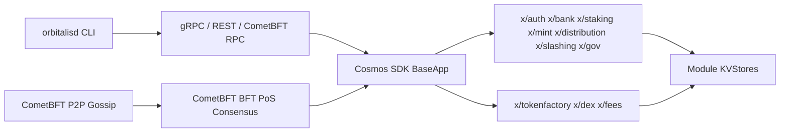

# Orbitalis Blockchain

Orbitalis is a sovereign Cosmos SDK Layer 1 blockchain implemented in Go. The native token is Orbitalis with display ticker `ORB`; the staking and fee base denom is `norb`, with `1 ORB = 1,000,000,000 norb`.

## Architecture



## Implemented

- `cmd/l1d`: Orbitalis node binary source and CLI.
- `app`: direct Cosmos SDK `BaseApp` assembly pinned to Cosmos SDK `v0.54.3` and CometBFT `v0.39.3`.
- `x/tokenfactory`: factory denoms, admin-controlled mint/burn, admin transfer, governance-bounded params, queries.
- `x/dex`: constant-product AMM pools, liquidity add/remove, exact-input swaps, LP tokens, governance-bounded params.
- `x/fees`: native protocol fee policy, collection accounting, module balance queries, and `norb`-only fee enforcement.
- `scripts/localnet`: configurable multi-validator localnet/testnet init/start/stop/reset, logs, metrics, snapshot, and state-sync helpers.

## Build And Test

```powershell
$env:PATH = "$PWD\.work\tools\go1.25.11\go\bin;$env:PATH"
go test ./...
go vet ./...
go build -o build/orbitalisd.exe ./cmd/l1d
```

If you already have Go `1.25.x` on PATH, the `.work` toolchain is not required.

Proto checks:

```powershell
$env:PATH = "$PWD\.work\tools\bin;$env:PATH"
buf lint
buf generate
```

`buf generate` writes verification output into ignored `.work\bufgen`; checked-in generated Go code lives under `x\*\types`.

## Local Multi-Validator Network

```powershell
.\scripts\localnet\init.ps1 -ValidatorCount 3
.\scripts\localnet\start.ps1
```

Port scheme is deterministic. P2P/RPC ports advance by `100` per validator; gRPC/REST advance by `1`.

- node0: P2P `26656`, RPC `26657`, gRPC `9090`, REST `1317`
- node1: P2P `26756`, RPC `26757`, gRPC `9091`, REST `1318`
- node2: P2P `26856`, RPC `26857`, gRPC `9092`, REST `1319`

For larger localnets:

```powershell
.\scripts\localnet\init.ps1 -OutputDir .localnet-5 -ValidatorCount 5
.\scripts\localnet\start.ps1 -OutputDir .localnet-5
.\scripts\localnet\init.ps1 -OutputDir .localnet-10 -ValidatorCount 10
.\scripts\localnet\start.ps1 -OutputDir .localnet-10
```

Each init writes `.localnet*\localnet.json` with node homes, RPC, REST, gRPC, CometBFT metrics, and Orbitalis app metrics URLs. Logs are under `.localnet*\logs`; CometBFT metrics are enabled at each node's manifest `metrics_url`, while app/module metrics are served at `app_metrics_url`.

Stop or reset:

```powershell
.\scripts\localnet\stop.ps1
.\scripts\localnet\reset.ps1
```

Smoke tests:

```powershell
.\tests\e2e\localnet_smoke.ps1 -ValidatorCounts 3
.\tests\e2e\localnet_smoke.ps1 -ValidatorCounts 3,5,10 -TimeoutSeconds 120
.\tests\e2e\adversarial_smoke.ps1 -SpamCount 3 -TimeoutSeconds 120
```

The smoke test checks block production, restart persistence, bank send, tokenfactory create/mint, DEX pool/swap, fee queries, and negative configuration paths.
The adversarial smoke test checks malformed broadcasts, wrong-fee-denom mempool spam, DEX same-denom pool rejection, and continued block production after rejected inputs.

Adversarial and cross-module coverage is documented in [docs/adversarial-e2e-coverage.md](docs/adversarial-e2e-coverage.md). Custom module attacker models live in [tests/adversarial/ATTACKER_MODEL.md](tests/adversarial/ATTACKER_MODEL.md).

Snapshot and state-sync helpers:

```powershell
.\scripts\localnet\snapshot.ps1 -OutputDir .localnet -NodeIndex 0
.\scripts\localnet\statesync.ps1 -OutputDir .localnet -TargetNodeIndex 2 -ResetData
```

The scripts never print or log generated mnemonics by default. Use `init.ps1 -DebugSecrets` only when you explicitly need to inspect generated secrets. Reset refuses paths outside the repository and paths that do not look like `.localnet*`.

Observability notes are in [docs/observability.md](docs/observability.md). App metrics are opt-in for `orbitalisd start` and localnet binds them to loopback.

## Example CLI

```powershell
build\orbitalisd.exe query block --node tcp://127.0.0.1:26657
build\orbitalisd.exe tx bank send node0 <to-address> 100000000000norb --home .localnet\node0\orbitalisd --chain-id orbitalis-local-1 --keyring-backend test --fees 1000000norb
build\orbitalisd.exe tx tokenfactory create-denom gold --home .localnet\node0\orbitalisd --chain-id orbitalis-local-1 --keyring-backend test --fees 1000000norb
build\orbitalisd.exe query tokenfactory params --node tcp://127.0.0.1:26657
build\orbitalisd.exe query dex params --node tcp://127.0.0.1:26657
build\orbitalisd.exe query fees params --node tcp://127.0.0.1:26657
build\orbitalisd.exe query fees accounting --node tcp://127.0.0.1:26657
build\orbitalisd.exe query fees module-balances --node tcp://127.0.0.1:26657
```

## External Databases

Orbitalis validator/full nodes do not require Redis or PostgreSQL for consensus, mempool, or state. Use external databases only for off-chain services such as indexers, explorers, analytics, or API caching, and pass credentials through environment variables or secret managers.
