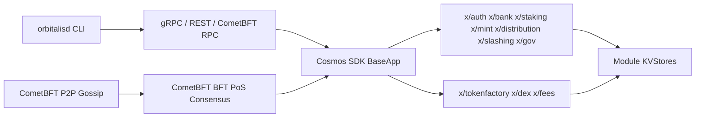

# Orbitalis Blockchain

Orbitalis is a sovereign Cosmos SDK Layer 1 blockchain implemented in Go. The native token is Orbitalis with display ticker `ORB`; the staking and fee base denom is `norb`, with `1 ORB = 1,000,000,000 norb`.

This repository is on the working prototype path. It is not mainnet-ready validator software: public validator onboarding, production governance economics, IBC/external bridges, exchange-grade DEX routing, and production release operations remain out of scope until the prototype gates say otherwise.

## Architecture



## Implemented

- `cmd/l1d`: Orbitalis node binary source and CLI.
- `app`: direct Cosmos SDK `BaseApp` assembly pinned to Cosmos SDK `v0.54.3` and CometBFT `v0.39.3`.
- `x/tokenfactory`: factory denoms, admin-controlled mint/burn, admin transfer, queries.
- `x/dex`: constant-product AMM pools, liquidity add/remove, exact-input swaps, LP tokens.
- `x/fees`: native fee-denom policy; v1 accepts only `norb` fees.
- `scripts/localnet`: 3-validator localnet init/start/stop/reset, health, and diagnostics scripts.
- Native token lifecycle: `norb` is the base transaction/staking/fee denom; `ORB` is display metadata only.

## Build And Test

```powershell
.\scripts\build-orbitalisd.ps1
go test ./...
go vet ./...
```

The build script prefers the repo-local Go toolchain under `.work\tools\go1.25.11`, falls back to `go` on PATH, runs `go mod verify`, builds `build\orbitalisd.exe`, and prints version/build metadata. It keeps Go build, temp, and module caches under ignored `.work` so a modified global Go module cache does not make local builds non-reproducible.

Proto checks:

```powershell
$env:PATH = "$PWD\.work\tools\bin;$env:PATH"
buf lint
.\scripts\proto\verify-generated.ps1 -Buf .\.work\tools\bin\buf.exe
```

`buf generate` writes verification output into ignored `.work\bufgen`; checked-in generated Go code lives under `x\*\types`. See [docs/proto-workflow.md](docs/proto-workflow.md) before changing proto contracts or generated files.

## Local 3-Node Network

```powershell
.\scripts\localnet\init.ps1
.\scripts\localnet\start.ps1
```

Ports:

- node0: P2P `26656`, RPC `26657`, gRPC `9090`, REST `1317`
- node1: P2P `26756`, RPC `26757`, gRPC `9091`, REST `1318`
- node2: P2P `26856`, RPC `26857`, gRPC `9092`, REST `1319`

Stop or reset:

```powershell
.\scripts\localnet\stop.ps1
.\scripts\localnet\reset.ps1
```

Prototype acceptance and targeted smoke tests:

```powershell
.\tests\e2e\prototype_smoke.ps1
.\tests\e2e\prototype_acceptance.ps1
.\tests\e2e\localnet_smoke.ps1
.\tests\e2e\pos_smoke.ps1
.\tests\e2e\native_token_smoke.ps1
.\tests\e2e\tokenfactory_smoke.ps1
.\tests\e2e\fees_ante_smoke.ps1
.\tests\e2e\dex_smoke.ps1
.\tests\e2e\query_surface_smoke.ps1
```

## Operator CLI

See [docs/prototype-contract.md](docs/prototype-contract.md) for the executable working-prototype contract, [docs/operator-commands.md](docs/operator-commands.md) for the full prototype operator command runbook, [docs/operator-troubleshooting.md](docs/operator-troubleshooting.md) for common failure triage, [docs/transaction-lifecycle-matrix.md](docs/transaction-lifecycle-matrix.md) for tx actor/signer/state/query coverage, [docs/event-contract.md](docs/event-contract.md) for custom tx event evidence, [docs/prototype-acceptance-suite.md](docs/prototype-acceptance-suite.md) for the one-command acceptance suite, [docs/security/prototype-audit-gate.md](docs/security/prototype-audit-gate.md) for the release security gate, [docs/release/prototype-package.md](docs/release/prototype-package.md) for prerelease packages, [docs/release/prototype-limitations.md](docs/release/prototype-limitations.md) for non-goals, limitations, and blocker classification, [docs/query-surface.md](docs/query-surface.md) for gRPC/REST endpoints, and [docs/observability.md](docs/observability.md) for health checks and diagnostics.

The README keeps only the shortest probes. Use the operator runbook for the end-to-end build, init, start, query, tx, diagnose, and stop transcript.

```powershell
build\orbitalisd.exe query block --node tcp://127.0.0.1:26657
build\orbitalisd.exe query bank denom-metadata norb --node tcp://127.0.0.1:26657 --output json
build\orbitalisd.exe query bank total-supply-of norb --node tcp://127.0.0.1:26657 --output json
build\orbitalisd.exe query bank balance <orb1-address> norb --node tcp://127.0.0.1:26657 --output json
build\orbitalisd.exe query fees params --grpc-addr 127.0.0.1:9090 --grpc-insecure --node tcp://127.0.0.1:26657 --output json
.\scripts\localnet\health.ps1 -ValidatorCount 3
```

## Governance And Release Path

Implementation work follows [docs/engineering-governance.md](docs/engineering-governance.md), [docs/security-testing.md](docs/security-testing.md), [docs/security/cosmos-security-checklist.md](docs/security/cosmos-security-checklist.md), [docs/transaction-lifecycle-matrix.md](docs/transaction-lifecycle-matrix.md), [docs/event-contract.md](docs/event-contract.md), and [docs/test-pyramid.md](docs/test-pyramid.md). Release packaging follows [docs/release/prototype-package.md](docs/release/prototype-package.md) and [docs/release/prototype-limitations.md](docs/release/prototype-limitations.md), and must include checksums, known limitations, blockers, test evidence, and the prototype audit summary.

Fast local gate:

```powershell
.\tests\e2e\prototype_smoke.ps1
.\scripts\security\prototype-audit.ps1 -Profile Fast
```

## External Databases

Orbitalis validator/full nodes do not require Redis or PostgreSQL for consensus, mempool, or state. Use external databases only for off-chain services such as indexers, explorers, analytics, or API caching, and pass credentials through environment variables or secret managers.
