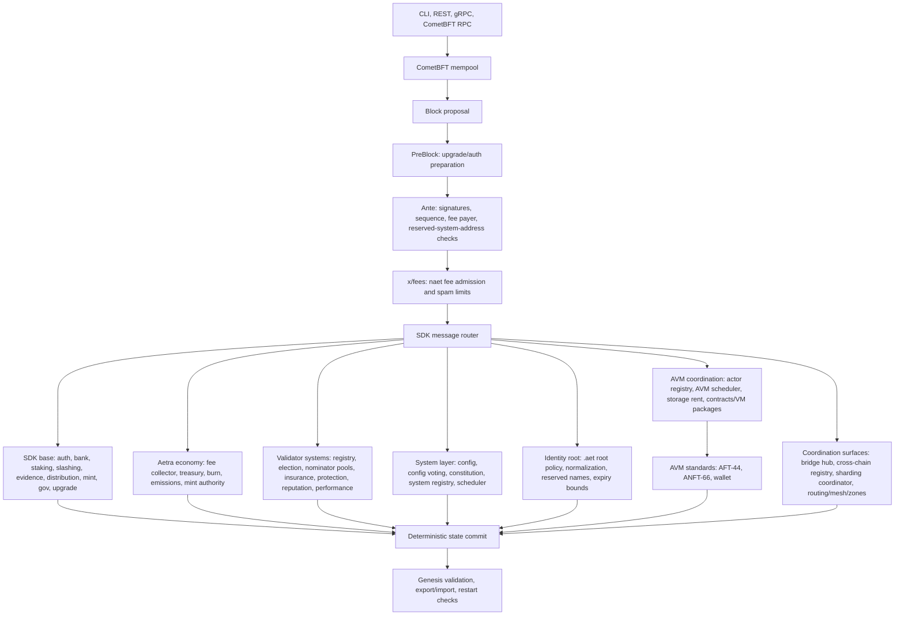

# Aetra Blockchain

Aetra is a sovereign Cosmos SDK Layer 1 blockchain implemented in Go. The repository lives at [SoftwareMaestro16/Aetra-Blockchain](https://github.com/SoftwareMaestro16/Aetra-Blockchain).

The native asset is **Aetra (`AET`)**. On chain it is represented as `naet`:

```text
1 AET = 1,000,000,000 naet
```

This repository is a fast-moving prototype and public-testnet preparation codebase. It already boots as a Cosmos SDK app with PoS, native fees, reserved system addresses, protocol economy modules, genesis validation, export/import tests, and localnet tooling. It is not mainnet-ready yet.

Local Aetra validator/full nodes do not require Redis or PostgreSQL for consensus, mempool, or application state.

## Current Surface

Aetra is a runnable Cosmos SDK chain with a broader native protocol surface layered around the standard PoS path. The design line is simple:

- native `x/` modules are kept for consensus safety, validator economics, fees, treasury accounting, governance/config, system entities, scheduling, storage rent, and AVM coordination;
- user application logic belongs in AVM contracts, including fungible tokens, NFTs, wallets, markets, auctions, workflow apps, and custom service logic;
- native tokenfactory and native exchange runtime modules are not part of the active app graph. AFT/ANFT/wallet standards remain as AVM contract standards under `x/aetravm/standards`.



### Implemented Today

| Area | Status | What is available |
| --- | --- | --- |
| Node and CLI | Implemented | `aetrad` binary, CometBFT node, CLI, REST, gRPC, RPC, AutoCLI/reflection, Windows localnet scripts. |
| Base account model | Implemented | Cosmos SDK `auth`, `vesting`, `bank`, fee grants, authz, custom Aetra address codec, zero-address rejection. |
| PoS execution | Implemented | Staking denom `naet`, validator creation, delegation, unbonding, redelegation, slashing, evidence, distribution, mint rewards. |
| Governance base | Implemented | SDK gov/upgrade/consensus params plus native constitution/config/config-voting/system-registry surfaces. |
| Native fee policy | Implemented | `x/fees` validates fee denom, minimum fee, hard cap, dynamic fee bounds, sender limits, block limits, and malformed fee cases. |
| Reserved system addresses | Implemented | Stable `4:` and protocol-core `-7:` raw addresses, `AE...` user-friendly forms, signer rejection, blocked bank-send policy, startup wiring checks. |
| Module accounts | Implemented | Reserved module accounts for mint authority, burn, fee collector, treasury, storage rent, delegator protection, validator insurance, reporter rewards, config, system registry, and validator election. |
| Protocol economy | Wired | Fee collector, treasury, burn, emissions, mint authority, delegator protection, validator insurance, reporter rewards, storage-rent reserve surfaces. |
| Validator systems | Wired | Validator registry/election, nominator pools, insurance, delegator protection, reputation, performance, dynamic commission, stake concentration. |
| Scheduler/system modules | Wired | Native scheduler, AVM scheduler, actor registry, storage rent, identity root, bridge hub, cross-chain registry, sharding coordinator. |
| Network coordination | Wired/spec surface | `x/aetracore`, `x/load`, `x/routing`, `x/zones`, `x/mesh`, `x/networking`, `x/payments` provide current protocol coordination surfaces. |
| AVM contract standards | Present | AFT-44 fungible token standard, ANFT-66 NFT/SBT standard, wallet standard, VM/contracts packages. These are not native app-token modules. |

### Transaction Path

1. A client broadcasts a tx through `aetrad`, REST, gRPC, or CometBFT RPC.
2. CometBFT admits it to the mempool and includes it in a proposal.
3. PreBlock runs upgrade/auth preparation.
4. Ante checks signer signatures, sequence, fee payer, account state, and reserved system address rules.
5. `x/fees` enforces `naet` fee policy before normal message execution.
6. The SDK router dispatches messages to Cosmos SDK modules or Aetra native keepers.
7. Native modules mutate only protocol/system state.
8. User-facing app logic is expected to go through AVM contracts and standards rather than native token/NFT/market modules.
9. BeginBlock/EndBlock ordering is explicit through `app/wiring/aetracore`, keeping export/import and restart behavior deterministic.

Important checks already enforced by tests and app startup:

- tx fees use `naet`;
- unsupported fee denoms are rejected;
- zero addresses are rejected;
- malformed raw/user-friendly addresses are rejected;
- reserved system addresses cannot be normal signers or fee payers;
- user sends to non-receivable system accounts are blocked;
- core `-7:` system addresses cannot receive user funds;
- module account permissions match reserved address constants;
- mint authority is wired to `AETMint`;
- burn sink is wired to `AETBurn`;
- duplicate reserved system address bytes are rejected.

## Native Protocol Modules

The active runtime keeps native code for protocol responsibilities:

- SDK base: `auth`, `bank`, `staking`, `slashing`, `evidence`, `distribution`, `mint`, `gov`, `upgrade`, `consensus`, `epochs`, `authz`, `feegrant`, `protocolpool`;
- configuration and authority: `x/config`, `x/config-voting`, `x/constitution`, `x/system-registry`;
- fees and economy: `x/fees`, `x/fee-collector`, `x/treasury`, `x/burn`, `x/emissions`, `x/mint-authority`;
- validator economics: `x/validator-registry`, `x/validator-election`, `x/nominator-pool`, `x/single-nominator-pool`, `x/validator-insurance`, `x/delegator-protection`, `x/reputation`, `x/performance`, `x/dynamic-commission`, `x/stake-concentration`;
- execution coordination: `x/scheduler`, `x/avm-scheduler`, `x/actor-registry`, `x/storage-rent`;
- identity root: `x/identity-root` for `.aet` root policy, uniqueness, reserved names, normalization, expiry bounds, and root registry policy;
- cross-system coordination: `x/bridge-hub`, `x/cross-chain-registry`, `x/sharding-coordinator`;
- protocol infrastructure/spec layers: `x/aetracore`, `x/load`, `x/routing`, `x/zones`, `x/mesh`, `x/networking`, `x/payments`, `x/contracts`, `x/vm`, `x/aetravm`.

## AVM Contract Surface

Application features are meant to be built as AVM contracts:

- fungible tokens: AFT-44 contracts in `x/aetravm/standards/aft`;
- NFTs and SBTs: ANFT-66 contracts in `x/aetravm/standards/anft`;
- wallet/account behavior: wallet standard in `x/aetravm/standards/aw`;
- app markets, auctions, services, workflow logic, permission models, and custom business rules should be contracts or SDK tooling around contracts.

The old `x/identity` package remains as a legacy/spec migration target. Root-only `.aet` logic belongs in native `x/identity-root`; domain NFT collections, resolvers, subdomain managers, auctions, and domain governance should migrate to AVM contracts.

The native account, official liquid staking, pool-share accounting, allocation,
stake reputation, proof, storage-rent, auth policy, and migration model is
documented in [Native Account, Staking, Reputation, And Rent Model](docs/native-account-staking-reputation.md).

## Economy

The native economy is split into clear accounting surfaces:

- `x/fees` admits txs only when fee policy is satisfied;
- `x/fee-collector` is the protocol income hub and bucket-accounting surface;
- `x/treasury` holds controlled treasury funds;
- `x/burn` records burn sinks and burn-by-send policy;
- `x/mint-authority` owns base-denom mint authority;
- `x/emissions` carries emission policy;
- `x/delegator-protection` and `x/validator-insurance` are safety reserve surfaces;
- `x/reporter` supports reporter reward accounting;
- `x/storage-rent` prepares rent accounting for persistent AVM state.

Protocol income is designed to route through deterministic buckets: validator rewards, treasury, delegator protection, validator insurance, ecosystem grants, storage rent reserve, burn, and reporter rewards. Weights must sum to 100%, zero-weight buckets must be explicit, rounding must be deterministic, and tests reconcile module accounting against bank balances.

The current console-testable economy surface includes:

- checking `x/fees` params and rejecting wrong fee denoms;
- sending `naet` with explicit fees;
- querying bank supply and module account balances;
- querying distribution rewards and validator commission;
- testing blocked sends to non-receivable system addresses;
- testing `AETBurn` receive behavior according to burn policy.

## PoS And Validators

The live validator path is Cosmos SDK staking with `naet`:

- validators can be initialized, created, bonded, queried, and jailed/slashed through SDK paths;
- delegators can delegate, unbond, redelegate, and withdraw rewards;
- distribution tracks delegator rewards, validator commission, outstanding rewards, and community-pool style accounting;
- slashing/evidence protect validator set safety;
- minting supports uncapped PoS reward issuance in `naet`;
- app tests cover validator transitions, genesis validation, export/import, and localnet boot behavior.

Aetra adds native validator-system modules for registry metadata, election coordination, nominator pools, validator insurance, delegator protection, reputation scoring, performance tracking, dynamic commission, and stake concentration controls. These modules are wired into BeginBlock/EndBlock and genesis/export ordering so they can be hardened toward public testnet without becoming user application modules.

## Addresses And System Accounts

Aetra uses a custom address codec:

- user raw address: `4:<64 lowercase hex>`;
- protocol-core raw address: `-7:<64 lowercase hex>`;
- user-friendly address: `AE...`;
- zero address is rejected by default.

Reserved system addresses are defined in `app/addressing/system_addresses.go`. They give native entities stable addresses for authority, accounting, and events without private keys.

Core `-7:` addresses are protocol-only and non-receivable by default:

- `AETElector`;
- `AETConfig`;
- `AETConstitution`;
- `AETSystemRegistry`;
- `AETValidatorRegistry`;
- `AETConfigVoting`.

Fund-capable or accounting-relevant reserved accounts include:

- `AETMint`: mint authority, not user-fundable;
- `AETBurn`: burn sink, can receive user funds only when policy permits;
- `AETFeeCollector`: protocol fee collection account, not directly user-fundable by default;
- `AETTreasury`: treasury account, not directly user-fundable by default;
- `AETStorageRent`: storage-rent accounting account;
- `AETDelegatorProtection`: delegator protection reserve;
- `AETValidatorInsurance`: validator insurance reserve;
- `AETReporterRewards`: reporter rewards reserve.

Startup validation checks that reserved module account addresses match constants, module-account permissions are correct, bank blocked-address policy matches `can_receive_user_funds`, `AETMint` is the mint authority, and `AETBurn` is the burn sink.

## Build

```powershell
.\scripts\build-aetrad.ps1
```

The build output is:

```text
build\aetrad.exe
```

## Localnet

```powershell
.\scripts\localnet\init.ps1 -ChainId aetra-local-1 -ValidatorCount 3
.\scripts\localnet\start.ps1 -ChainId aetra-local-1
```

Default local endpoints:

- node0: P2P `26656`, RPC `26657`, gRPC `9090`, REST `1317`;
- node1: P2P `26666`, RPC `26667`, gRPC `9100`, REST `1327`;
- node2: P2P `26676`, RPC `26677`, gRPC `9110`, REST `1337`.

## Common Commands

```powershell
build\aetrad.exe query block --node tcp://127.0.0.1:26657
build\aetrad.exe query bank denom-metadata naet --node tcp://127.0.0.1:26657 --output json
build\aetrad.exe query bank total-supply-of naet --node tcp://127.0.0.1:26657 --output json
build\aetrad.exe query fees params --grpc-addr 127.0.0.1:9090 --grpc-insecure --node tcp://127.0.0.1:26657 --output json
```

Send native funds on localnet:

```powershell
$node0 = build\aetrad.exe keys show node0 -a --home .localnet\node0\aetrad --keyring-backend test
$node1 = build\aetrad.exe keys show node1 -a --home .localnet\node1\aetrad --keyring-backend test

build\aetrad.exe tx bank send node0 $node1 1000naet `
  --home .localnet\node0\aetrad `
  --keyring-backend test `
  --chain-id aetra-local-1 `
  --node tcp://127.0.0.1:26657 `
  --fees 100naet `
  -y
```

## Next Local Testnet Console Pass

Use this checklist when manually exercising the chain:

1. Build and inspect the binary.

```powershell
.\scripts\build-aetrad.ps1
build\aetrad.exe version --long --output json
```

2. Start a clean multi-validator localnet.

```powershell
.\scripts\localnet\init.ps1 -ChainId aetra-local-1 -ValidatorCount 3
.\scripts\localnet\start.ps1 -ChainId aetra-local-1
```

3. Check node health, blocks, supply, and fees.

```powershell
build\aetrad.exe status --node tcp://127.0.0.1:26657
build\aetrad.exe query block --node tcp://127.0.0.1:26657
build\aetrad.exe query bank total-supply-of naet --node tcp://127.0.0.1:26657 --output json
build\aetrad.exe query fees params --grpc-addr 127.0.0.1:9090 --grpc-insecure --node tcp://127.0.0.1:26657 --output json
```

4. Exercise account and bank flow.

```powershell
$node0 = build\aetrad.exe keys show node0 -a --home .localnet\node0\aetrad --keyring-backend test
$node1 = build\aetrad.exe keys show node1 -a --home .localnet\node1\aetrad --keyring-backend test

build\aetrad.exe query bank balances $node0 --node tcp://127.0.0.1:26657 --output json
build\aetrad.exe query bank balances $node1 --node tcp://127.0.0.1:26657 --output json
build\aetrad.exe tx bank send node0 $node1 1000naet --home .localnet\node0\aetrad --keyring-backend test --chain-id aetra-local-1 --node tcp://127.0.0.1:26657 --fees 1000000naet -y
```

5. Exercise validator and staking flow.

```powershell
build\aetrad.exe query staking validators --node tcp://127.0.0.1:26657 --output json
build\aetrad.exe query staking delegations $node0 --node tcp://127.0.0.1:26657 --output json
build\aetrad.exe query distribution rewards $node0 --node tcp://127.0.0.1:26657 --output json
```

6. Exercise system-account and fee-distribution visibility.

```powershell
build\aetrad.exe query auth module-account feecollector --node tcp://127.0.0.1:26657 --output json
build\aetrad.exe query auth module-account feecollector_treasury --node tcp://127.0.0.1:26657 --output json
build\aetrad.exe query auth module-account burn --node tcp://127.0.0.1:26657 --output json
build\aetrad.exe query auth module-account mint-authority --node tcp://127.0.0.1:26657 --output json
```

7. Negative tests worth running before public testnet:

- send with a non-`naet` fee denom and expect rejection;
- send from a reserved system address and expect signer rejection;
- send to `AETMint`, `AETConfig`, or another non-receivable system address and expect rejection;
- send to `AETBurn` only when burn-by-send policy permits it;
- export genesis, restart from it, and confirm validators, balances, system accounts, and fee params survive.

## Token Summary

- Name: `Aetra`
- Symbol/display denom: `AET`
- Base denom: `naet`
- Conversion: `1 AET = 1,000,000,000 naet`
- Staking denom: `naet`
- Fee denom: `naet`
- Mint denom: `naet`
- Supply: uncapped PoS supply through inflation and rewards

## Security Posture

Current hardening work includes deterministic genesis validation, export/import roundtrip tests, zero-address rejection, reserved system address parsing and signer rejection, native fee validation, bounded dynamic fees, malformed transaction checks, module-account wiring validation, blocked-address policy, localnet smoke scripts, and security workflow coverage.

## Public Testnet Status

Before public testnet, Aetra still needs the full readiness gate: module params documented, native modules covered by genesis/export/import/authority/invariant/migration tests, fee/mint/burn accounting reconciled with bank supply, validator set transitions tested across epochs, AVM storage-rent lifecycle tested, scheduler gas bounds enforced, no unbounded user-controlled iteration, multi-validator localnet restart checks, and independent security review.
