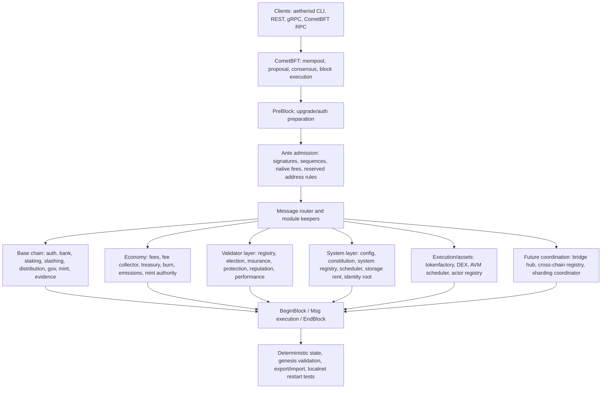

# Aetra Blockchain

Aetra is a sovereign Cosmos SDK Layer 1 blockchain implemented in Go. The repository lives at [SoftwareMaestro16/Aetra-Blockchain](https://github.com/SoftwareMaestro16/Aetra-Blockchain).

The native asset is **Aetra (`AET`)**. On chain it is represented as the base denomination `naet`, where:

```text
1 AET = 1,000,000,000 naet
```

This codebase is a fast-moving prototype and testnet-preparation chain. It already boots as a Cosmos SDK application with PoS, native fees, staking, governance, custom modules, system entities, genesis validation, export/import tests, and localnet scripts. It is not mainnet-ready yet.

Local Aetra validator/full nodes do not require Redis or PostgreSQL for consensus, mempool, or application state.

## Current Surface

Aetra is already more than a minimal Cosmos SDK chain. The current codebase has a working base chain, PoS staking, native fee admission, protocol economy modules, reserved system addresses, system module-account wiring, localnet tooling, and many native Aetra modules wired into genesis and block ordering. Some of those modules are live runtime modules; some are prepared system surfaces that are intentionally gated until testnet/audit readiness.



### Runtime Layers

The implemented and wired surface is split across several layers:

| Layer | Current status | What it does |
| --- | --- | --- |
| Node and consensus | Implemented | `aetherisd`, CometBFT consensus, mempool admission, block execution, localnet scripts, RPC/gRPC/REST query surface. |
| Core accounts and money movement | Implemented | `auth`, `bank`, custom address codec, zero-address policy, reserved system address policy, blocked-address policy. |
| PoS base | Implemented | Cosmos SDK staking with `naet`, validator creation, delegation, unbonding, redelegation, slashing, distribution, mint rewards. |
| Native fee admission | Implemented | `x/fees` enforces `naet` fees, minimum fee, hard cap, congestion-aware fee checks, sender/block spam controls. |
| Protocol economy | Implemented/wired | Fee collector, treasury, burn, emissions, mint authority, validator insurance, delegator protection, reporter rewards, storage-rent reserve surfaces. |
| Validator system layer | Implemented/wired | Validator registry, validator election, nominator pools, insurance, protection, reputation, performance oracle, dynamic commission, stake concentration. |
| System entity layer | Implemented/wired | Config, config voting, constitution, system registry, scheduler, actor registry, storage rent, identity root, bridge hub, cross-chain registry, sharding coordinator. |
| User asset layer | Implemented | Tokenfactory assets and constant-product DEX pools, liquidity, swaps, and LP-token surface. |
| AVM direction | Prototype/gated | AVM, async execution specs, actor registry, AVM scheduler, conflict/read-write scheduling surfaces. Production state mutation remains gated. |

### Transaction Path

A normal transaction follows this path:

1. The user signs and broadcasts through `aetherisd`, REST, gRPC, or CometBFT RPC.
2. CometBFT admits it into mempool and later proposes it in a block.
3. PreBlock prepares core upgrade/auth flow.
4. Aetra ante validation runs before message execution.
5. The fee decorator enforces native `naet` fee policy, bounded dynamic fees, signer policy, fee payer policy, and reserved system address restrictions.
6. Cosmos SDK auth verifies signatures and account sequence.
7. Messages route to module keepers such as `bank`, `staking`, `gov`, `tokenfactory`, `dex`, `burn`, `treasury`, `fees`, and the Aetra native modules.
8. BeginBlocker and EndBlocker ordering is explicit in `app/aether_core_wiring.go`.
9. State is committed through deterministic stores and can be exported/imported for restart testing.

Admission rules that are already enforced:

- protocol fees are paid in `naet`;
- fee checks run before custom messages can mutate state;
- malformed, zero, and unsupported addresses are rejected;
- reserved system addresses cannot sign user transactions;
- user sends to non-receivable system addresses are rejected;
- `AETBurn` can receive user funds when burn-by-send policy allows it;
- core `-7:` protocol addresses do not receive user funds;
- system module-account permissions and blocked-address policy are validated at startup.

### Economy And Accounting Surface

The chain already has dedicated modules for protocol money flows:

- `x/fees` controls transaction fee admission.
- `x/fee-collector` is the protocol income hub and bucket-accounting surface.
- `x/treasury` manages controlled treasury allocations and spend lifecycle.
- `x/burn` records user and protocol burns.
- `x/mint-authority` controls base-denom mint authority.
- `x/emissions` holds emission policy surface.
- `x/delegator-protection` and `x/validator-insurance` provide safety reserve surfaces.
- `x/reporter` supports reporter reward accounting.
- `x/storage-rent` prepares rent accounting for persistent AVM state.

The intended distribution model routes protocol income through deterministic buckets: validator rewards, treasury, delegator protection, validator insurance, ecosystem grants, storage rent reserve, burn, and reporter rewards. Required accounting tests compare module accounting with bank balances.

### Validator And PoS Surface

The live PoS base is Cosmos SDK staking with `naet`:

- validators can be created and bonded;
- delegators can delegate, unbond, and redelegate;
- distribution handles validator and delegator rewards;
- slashing/evidence protect the validator set;
- minting supports uncapped PoS reward issuance;
- validator transitions and restart/export behavior are covered by app tests.

Aetra adds native validator modules around that base:

- `x/validator-registry` for native validator metadata and status;
- `x/validator-election` for future validator set coordination;
- `x/nominator-pool` and `x/single-nominator-pool`;
- `x/validator-insurance`;
- `x/delegator-protection`;
- `x/reputation`;
- `x/performance`;
- `x/dynamic-commission`;
- `x/stake-concentration`.

### System And Execution Surface

The app wires a broad native system layer:

- governance-adjacent system modules: `x/config`, `x/config-voting`, `x/constitution`, `x/system-registry`;
- automation and execution coordination: `x/scheduler`, `x/avm-scheduler`, `x/actor-registry`;
- persistence and identity: `x/storage-rent`, `x/identity-root`;
- external/future coordination: `x/bridge-hub`, `x/cross-chain-registry`, `x/sharding-coordinator`;
- asset/application modules: `x/tokenfactory`, `x/dex`, `x/burn`, `x/treasury`.

Reserved system addresses and module accounts are part of this surface. They give native entities stable addresses for authority, accounting, and events without private keys.

### Gated Surface

The README separates implemented wiring from production activation. AVM state mutation, cross-chain bridge finalization, sharding, and full storage-rent enforcement are still gated until the required module tests, invariants, long-run localnet runs, migrations, and security audits are complete.

## Implemented Runtime

### Base Chain

- Cosmos SDK application wiring in `app`.
- CometBFT consensus integration.
- `aetherisd` node binary and CLI in `cmd/l1d`.
- Account, bank, staking, distribution, slashing, governance, mint, evidence, feegrant, authz, upgrade, epochs, protocolpool, and consensus parameter modules.
- Deterministic genesis policy and export/import checks.
- Localnet scripts for multi-validator testing.

### Addresses And System Accounts

Aetra uses a custom address codec:

- user raw address: `4:<64 lowercase hex>`;
- protocol-core raw address: `-7:<64 lowercase hex>`;
- user-friendly address: `AE...`;
- zero address is rejected by default.

Reserved system addresses are defined in `app/addressing/system_addresses.go`. They cover core entities such as elector, config, constitution, system registry, validator registry, config voting, mint, burn, fee collector, treasury, storage rent, actor registry, identity root, bridge hub, sharding coordinator, and other native modules.

Reserved system module accounts are wired in `app/system_module_accounts.go`. Fund-capable or accounting-relevant accounts include:

- `AETMint` / `mint-authority`;
- `AETBurn` / `burn`;
- `AETFeeCollector`;
- `AETTreasury`;
- `AETStorageRent`;
- `AETDelegatorProtection`;
- `AETValidatorInsurance`;
- `AETReporterRewards`.

Core registry/config/elector accounts are non-spendable system accounts for authority and event identity. No system address has a private key.

### Fees

`x/fees` is the chain-level fee admission layer.

- Only `naet` is accepted as a protocol fee denom in v1.
- Delivered transactions must pay at least the configured minimum fee.
- A bounded dynamic fee reacts to block gas utilization.
- A hard cap prevents fee auctions from becoming the priority mechanism.
- Per-sender and block-level protections limit spam pressure.
- Fee validation runs before message execution and before custom messages can mutate state.

### Economy

The economy is split into explicit modules instead of one opaque account:

- `x/fee-collector`: collects protocol income and prepares deterministic bucket accounting.
- `x/treasury`: treasury allocations and controlled spend lifecycle.
- `x/burn`: user/protocol burn accounting by denom and epoch.
- `x/emissions`: emission policy surface.
- `x/mint-authority`: controlled mint authority for the base denom.
- `x/delegator-protection`: protection fund surface.
- `x/validator-insurance`: validator insurance reserve surface.
- `x/reporter`: reporter reward surface.
- `x/storage-rent`: rent and storage reserve surface for future AVM contracts.

Protocol income is designed to route through configurable buckets such as validator rewards, treasury, delegator protection, validator insurance, ecosystem grants, storage rent reserve, burn, and reporter rewards. Bucket weights must be deterministic and reconcile against bank balances.

### Proof Of Stake And Validators

Aetra uses Cosmos SDK staking as the live PoS base:

- validators are created through staking transactions;
- delegators can delegate, unbond, and redelegate `naet`;
- staking denom is `naet`;
- distribution handles validator/delegator rewards;
- slashing and evidence modules are wired for validator safety;
- minting supports uncapped PoS supply through inflation and rewards.

Native validator-system modules extend the target validator surface:

- `x/validator-registry`: native validator metadata and status registry;
- `x/validator-election`: validator set/election coordination surface;
- `x/nominator-pool` and `x/single-nominator-pool`: nominator-pool surfaces;
- `x/validator-insurance`: insurance accounting;
- `x/delegator-protection`: protection accounting;
- `x/reputation`: account/validator reputation scoring surface;
- `x/performance`: performance oracle surface;
- `x/dynamic-commission`: commission policy surface;
- `x/stake-concentration`: decentralization and concentration controls.

Some of these modules are already wired with genesis, keeper state, tests, and query/msg surfaces; others are intentionally gated or prototype-level until public testnet readiness criteria are met.

### Native System Entity Layer

Aetra has a native system-entity direction beyond standard Cosmos modules:

- `x/config`: protocol configuration state.
- `x/config-voting`: controlled voting path for critical configuration changes.
- `x/constitution`: constitutional guardrail surface.
- `x/system-registry`: registry for native system entities.
- `x/scheduler`: periodic/delayed job surface.
- `x/avm-scheduler`: AVM execution scheduling and conflict-coordination surface.
- `x/actor-registry`: AVM actor/contract account registry surface.
- `x/storage-rent`: storage-rent lifecycle surface.
- `x/identity-root`: `.aet` identity/name root surface.
- `x/bridge-hub`: bridge coordination surface.
- `x/cross-chain-registry`: trusted external chain/channel/route registry surface.
- `x/sharding-coordinator`: future shard/zone allocation surface.

These modules are wired into app genesis ordering and block ordering. Production activation still depends on module-specific tests, migrations, invariants, long-run localnet checks, and audit gates.

### Execution And Assets

Implemented or wired execution/application surfaces:

- `x/tokenfactory`: factory denoms, mint, burn, and admin lifecycle.
- `x/dex`: constant-product pool surface, swaps, liquidity, and LP tokens.
- `x/aetherisvm`: AVM and async execution executable specifications.
- `x/actor-registry` and `x/avm-scheduler`: native AVM account and scheduling surfaces.

AVM state mutation is not treated as production-ready until gas accounting, storage bounds, async queues, conflict handling, export/import, fuzzing, and independent audit gates pass.

## Build

```powershell
.\scripts\build-aetherisd.ps1
```

The build script uses the repo-local Go toolchain under `.work\tools\go1.25.11` when present, falls back to `go` on PATH, runs `go mod verify`, and builds:

```text
build\aetherisd.exe
```

If disk space is tight, lower the local guard explicitly:

```powershell
.\scripts\build-aetherisd.ps1 -MinFreeGB 2
```

## Localnet

Initialize and start a 3-validator localnet:

```powershell
.\scripts\localnet\init.ps1 -ChainId aetheris-local-1 -ValidatorCount 3
.\scripts\localnet\start.ps1 -ChainId aetheris-local-1
```

Short smoke and audit probes:

```powershell
.\tests\e2e\prototype_smoke.ps1
.\scripts\security\prototype-audit.ps1 -Profile Fast
```

Default local endpoints:

- node0: P2P `26656`, RPC `26657`, gRPC `9090`, REST `1317`;
- node1: P2P `26666`, RPC `26667`, gRPC `9100`, REST `1327`;
- node2: P2P `26676`, RPC `26677`, gRPC `9110`, REST `1337`.

Each init writes `.localnet*\localnet.json` with node homes, RPC, REST, gRPC, CometBFT metrics, and Aetra app metrics URLs. Logs are under `.localnet*\logs`.

## Common Commands

Query chain state:

```powershell
build\aetherisd.exe query block --node tcp://127.0.0.1:26657
build\aetherisd.exe query bank denom-metadata naet --node tcp://127.0.0.1:26657 --output json
build\aetherisd.exe query bank total-supply-of naet --node tcp://127.0.0.1:26657 --output json
build\aetherisd.exe query fees params --grpc-addr 127.0.0.1:9090 --grpc-insecure --node tcp://127.0.0.1:26657 --output json
build\aetherisd.exe query tokenfactory params --node tcp://127.0.0.1:26657 --output json
build\aetherisd.exe query dex params --node tcp://127.0.0.1:26657 --output json
```

Send native funds on localnet:

```powershell
$node0 = build\aetherisd.exe keys show node0 -a --home .localnet\node0\aetherisd --keyring-backend test
$node1 = build\aetherisd.exe keys show node1 -a --home .localnet\node1\aetherisd --keyring-backend test

build\aetherisd.exe tx bank send node0 $node1 1000naet `
  --home .localnet\node0\aetherisd `
  --keyring-backend test `
  --chain-id aetheris-local-1 `
  --node tcp://127.0.0.1:26657 `
  --fees 1000000naet `
  -y
```

## Token Summary

- Name: `Aetra`
- Symbol/display denom: `AET`
- Base denom: `naet`
- Conversion: `1 AET = 1,000,000,000 naet`
- Staking denom: `naet`
- Fee denom: `naet`
- Mint denom: `naet`
- Supply: uncapped PoS supply through inflation and rewards

Operators and scripts should use `naet` for balances, fees, staking, and transaction amounts. `AET` is display metadata.

## Security Posture

Current hardening work includes:

- deterministic genesis validation;
- export/import roundtrip tests;
- zero-address rejection;
- reserved system address parsing and signer rejection;
- native-only fee validation;
- bounded dynamic fees;
- malformed transaction and wrong-chain checks;
- staking, delegation, unbonding, redelegation, slashing, downtime, and restart tests;
- module-account wiring validation;
- bank blocked-address policy for system accounts;
- govulncheck, gosec, gitleaks, dependency review, and CodeQL workflows.

## Documentation

Useful docs:

- [Operator Commands](docs/operator-commands.md)
- [Prototype Contract](docs/prototype-contract.md)
- [Operator Troubleshooting](docs/operator-troubleshooting.md)
- [Transaction Lifecycle Matrix](docs/transaction-lifecycle-matrix.md)
- [Event Contract](docs/event-contract.md)
- [Prototype Acceptance Suite](docs/prototype-acceptance-suite.md)
- [Prototype Audit Gate](docs/security/prototype-audit-gate.md)
- [Prototype Release Package](docs/release/prototype-package.md)
- [Prototype Limitations](docs/release/prototype-limitations.md)
- [Query Surface](docs/query-surface.md)
- [Observability](docs/observability.md)
- [Engineering Governance](docs/engineering-governance.md)
- [Security Testing](docs/security-testing.md)
- [Cosmos Security Checklist](docs/security/cosmos-security-checklist.md)
- [Test Pyramid](docs/test-pyramid.md)
- [Public Testnet Preparation](docs/public-testnet-preparation.md)
- [Validator Onboarding](docs/validator-onboarding.md)

## Public Testnet Status

Before public testnet, Aetra still needs the full readiness gate:

- all module params documented;
- every native module covered by genesis, export/import, authority, invariant, malformed message, and migration tests;
- fee/mint/burn accounting reconciled with bank supply;
- validator set transitions tested across multiple epochs;
- storage-rent freeze/unfreeze/delete tested with AVM contracts;
- scheduler gas bounds enforced under load;
- no unbounded user-controlled iteration;
- localnet multi-validator runs covering epoch transition, slashing, evidence, fee distribution, storage rent, and export/import restart;
- independent security review.
