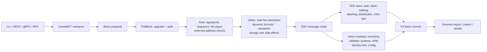
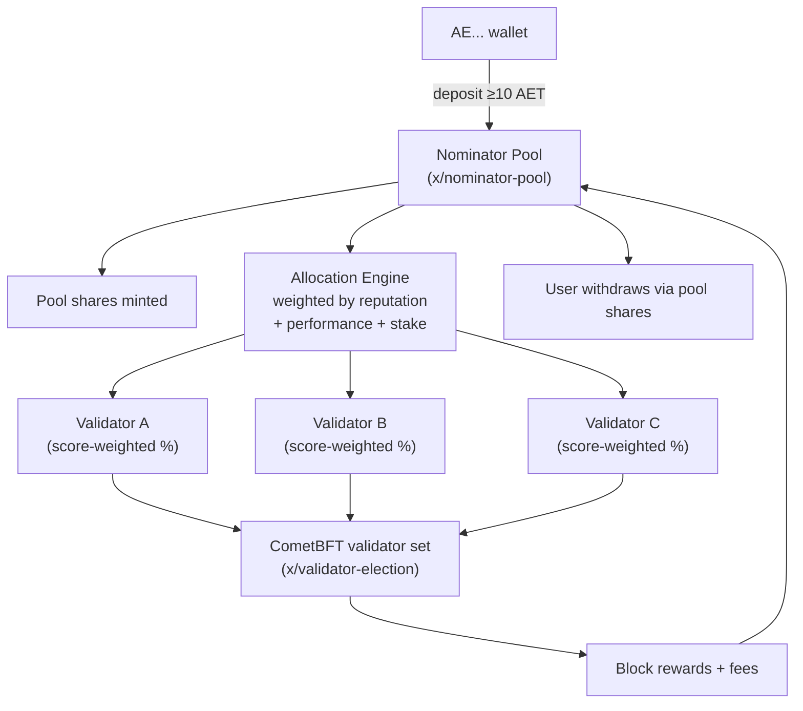
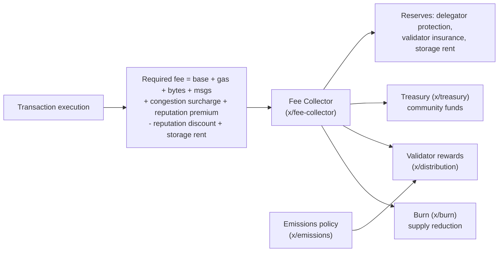
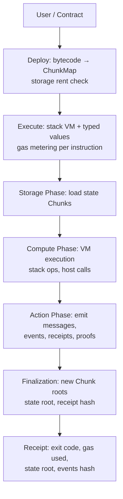
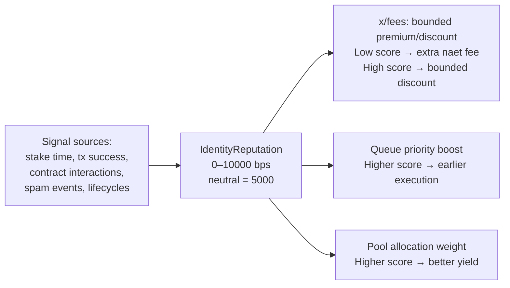

# Aetra Blockchain

Aetra is a sovereign Cosmos SDK Layer 1 blockchain implemented in Go — a deterministic, account-based PoS chain with an embedded Aetra Virtual Machine (AVM) for smart contracts. Built for moderate hardware, pool-based staking, and governance-controlled economics.

| Property | Value |
|----------|-------|
| Native asset | **AET** (1 AET = 10⁹ naet) |
| Consensus | CometBFT (2–5s blocks) |
| VM | AVM v1 — stack-based, typed, deterministic |
| Staking | Pool-based, no direct user→validator choice |
| Fee target | ~0.01 AET per transfer (governance-adjustable) |
| Address format | User: `AE...` / Raw: `4:...` / Protocol: `-7:...` |

## Quick Start

```powershell
.\scripts\build-aetrad.ps1
.\scripts\localnet\init.ps1 -ChainId aetra-local-1 -ValidatorCount 3
.\scripts\localnet\start.ps1 -ChainId aetra-local-1
```

No Redis, no PostgreSQL — just the binary and CometBFT.

---

## Key Subsystems

### 1. Transaction Lifecycle



### 2. Staking & Validator Set

Users never choose a validator. All deposits go into the official nominator pool, which allocates to validators by deterministic weights:



- `MsgDepositToStakingPool` has no validator field — rejected at validation
- `MsgDelegate` disabled for normal user path
- Validator selection via `ValidatorScore`, `DynamicCommission`, `StakeConcentration`

### 3. Fee Economy

Every transaction pays a deterministic fee that splits across protocol buckets:



Fee formula parameters — including `min_tx_fee_naet`, `base_transfer_fee_naet`, `target_transfer_fee_naet`, `low_reputation_premium_cap_naet`, `high_reputation_discount_cap_naet`, congestion thresholds — are governance/genesis params. Neutral transfer target: `0.01 AET`.

### 4. AVM Smart Contract Execution



- Content-addressed immutable Chunks (≤2048 data bits, ≤8 refs)
- Typed values: uint/int 8–256, address, hash, coins, tuple, Chunk
- Deterministic: same code/state/message → same exit code, gas, receipt, root
- Get methods are read-only, no state mutation
- Storage rent enforced before execution

### 5. Reputation System

Identity reputation is a single unified score fed by on-chain signals, influencing fee premiums/discounts and allocation priority — but never blocking basic rights:



- Reputation is a soft weighting signal, not a permission gate
- Low reputation cannot block transfers, staking, token/NFT creation, or contract deploy
- All effect caps are governance params

---

## Addresses

- **User-friendly**: `AE...` (Bech32-like, user-facing everywhere)
- **Raw internal**: `4:<64 hex chars>` (256-bit high-entropy)
- **Protocol core**: `-7:<64 hex chars>` (non-receivable system addresses)
- Zero addresses rejected by default

Key system accounts: `AETMint`, `AETBurn`, `AETFeeCollector`, `AETTreasury`, `AETStorageRent`, `AETDelegatorProtection`, `AETValidatorInsurance`, `AETReporterRewards`.

---

## Native Modules

| Category | Modules |
|----------|---------|
| SDK base | `auth`, `bank`, `staking`, `slashing`, `evidence`, `distribution`, `mint`, `gov`, `upgrade`, `consensus`, `epochs`, `authz`, `feegrant` |
| Config & authority | `x/config`, `x/config-voting`, `x/constitution`, `x/system-registry` |
| Economy | `x/fees`, `x/fee-collector`, `x/treasury`, `x/burn`, `x/emissions`, `x/mint-authority` |
| Validator systems | `x/validator-registry`, `x/validator-election`, `x/nominator-pool`, `x/validator-insurance`, `x/delegator-protection`, `x/reputation`, `x/performance`, `x/dynamic-commission`, `x/stake-concentration` |
| Execution | `x/scheduler`, `x/avm-scheduler`, `x/actor-registry`, `x/storage-rent` |
| Identity | `x/identity-root` |
| AVM | `x/aetravm`, `x/contracts`, `x/vm` |
| Cross-chain | `x/bridge-hub`, `x/cross-chain-registry`, `x/sharding-coordinator` |

No native token/NFT/DEX modules — application assets belong in AVM contracts (AFT-44, ANFT-66).

---

## Build & Run

```powershell
# Build
.\scripts\build-aetrad.ps1          # → build\aetrad.exe

# Local 3-validator network
.\scripts\localnet\init.ps1 -ChainId aetra-local-1 -ValidatorCount 3
.\scripts\localnet\start.ps1 -ChainId aetra-local-1

# Validate genesis
.\scripts\localnet\validate-genesis.ps1

# Monitor health
.\scripts\localnet\health.ps1
.\scripts\localnet\wait-height.ps1 -Height 10

# Export & restart
.\scripts\localnet\export-genesis.ps1 -Output genesis-export.json
.\scripts\localnet\reset.ps1
.\scripts\localnet\init.ps1 -ChainId aetra-local-1 -ValidatorCount 3
.\scripts\localnet\start.ps1 -ChainId aetra-local-1
```

Also available: `scripts/localnet/diagnostics.ps1`, `statesync.ps1`, `snapshot.ps1`, `stress-profile.ps1`.

---

## Common Commands

```powershell
build\aetrad.exe version --long --output json
build\aetrad.exe status --node tcp://127.0.0.1:26657
build\aetrad.exe query block --node tcp://127.0.0.1:26657
build\aetrad.exe query bank total-supply-of naet --node tcp://127.0.0.1:26657 --output json
build\aetrad.exe query staking validators --node tcp://127.0.0.1:26657 --output json
build\aetrad.exe query fees params --grpc-addr 127.0.0.1:9090 --grpc-insecure --output json
```

---

## Validator Info

For operator guides see [docs/VALIDATOR.md](docs/VALIDATOR.md), [docs/TESTNET.md](docs/TESTNET.md), and [docs/COSMOVISOR.md](docs/COSMOVISOR.md).

---

## Token

| Field | Value |
|-------|-------|
| Name | Aetra |
| Symbol | AET |
| Base denom | `naet` |
| Conversion | `1 AET = 1,000,000,000 naet` |
| Staking denom | `naet` |
| Fee denom | `naet` |
| Supply | Governance-capped emissions + validator rewards |

---

## Security

Deterministic genesis validation, export/import roundtrip tests, zero-address rejection, reserved system address checks, native fee validation, bounded dynamic fees, reputation-based fee adjustments, module-account wiring invariants, blocked-address policy, and localnet smoke tests.
