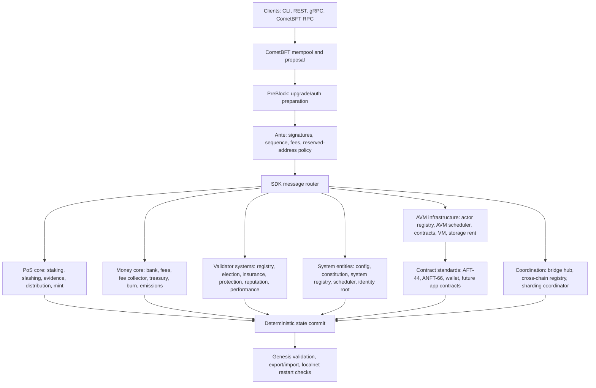

# Aetra Blockchain

Aetra is a sovereign Cosmos SDK Layer 1 blockchain implemented in Go. The repository lives at [SoftwareMaestro16/Aetra-Blockchain](https://github.com/SoftwareMaestro16/Aetra-Blockchain).

The native asset is **Aetra (`AET`)**. On chain it is represented as `naet`:

```text
1 AET = 1,000,000,000 naet
```

This repository is a fast-moving prototype and public-testnet preparation codebase. It already boots as a Cosmos SDK app with PoS, native fees, reserved system addresses, protocol economy modules, genesis validation, export/import tests, and localnet tooling. It is not mainnet-ready yet.

Local Aetra validator/full nodes do not require Redis or PostgreSQL for consensus, mempool, or application state.

## Current Surface

Aetra is not just a base Cosmos SDK skeleton. The current chain surface is split into protocol-native layers and AVM contract layers:

- native `x/` modules are for chain safety, PoS, accounting, protocol configuration, system entities, scheduling, storage rent, identity root, and AVM runtime coordination;
- user/application logic such as fungible tokens, NFTs, marketplaces, workflow apps, and exchange-style liquidity should live as AVM contracts;
- native contract-assets and native DEX runtime modules have been removed from the app graph. AFT/ANFT standards remain under `x/aetravm/standards` as contract standards.



### Runtime Layers

| Layer | Current status | What it does |
| --- | --- | --- |
| Node and consensus | Implemented | Node binary/CLI, CometBFT consensus, mempool admission, block execution, RPC/gRPC/REST query surface, localnet scripts. |
| Accounts and bank | Implemented | `auth`, `bank`, custom Aetra address codec, zero-address rejection, reserved system address catalog, blocked-address policy. |
| PoS base | Implemented | `naet` staking, validator creation, delegation, unbonding, redelegation, slashing/evidence, distribution, mint rewards. |
| Native fee admission | Implemented | `x/fees` enforces `naet` fees, minimum fee, hard cap, dynamic fee bounds, sender/block spam controls. |
| Protocol economy | Implemented/wired | Fee collector, treasury, burn, emissions, mint authority, validator insurance, delegator protection, reporter rewards, storage-rent reserve surfaces. |
| Validator systems | Implemented/wired | Validator registry, validator election, nominator pools, insurance, protection, reputation, performance, dynamic commission, stake concentration. |
| Native system entities | Implemented/wired | Config, config voting, constitution, system registry, scheduler, actor registry, storage rent, identity root, bridge hub, cross-chain registry, sharding coordinator. |
| AVM infrastructure | Prototype/gated | VM/contract packages, AVM scheduler, actor registry, async execution specs, read/write-set coordination, storage-rent direction. |
| Contract standards | Executable specs | AFT-44 fungible token standard, ANFT-66 NFT/SBT standard, wallet standard. These are contract surfaces, not native app modules. |

### Transaction Path

1. A user signs and broadcasts a tx through CLI, REST, gRPC, or CometBFT RPC.
2. CometBFT admits it to mempool and proposes it in a block.
3. PreBlock prepares upgrade/auth-related state.
4. Ante validation checks fee payer, signers, account sequence, signatures, fee policy, and reserved system address rules.
5. `x/fees` enforces native `naet` fee policy before message execution.
6. Cosmos SDK auth verifies signer state and sequence.
7. The SDK router dispatches messages to native keepers.
8. Native protocol modules mutate only protocol/system state.
9. AVM/application behavior is expected to execute through contract/runtime surfaces, not native token/NFT/market modules.
10. BeginBlock/EndBlock ordering stays explicit and deterministic; state can be exported/imported for restart checks.

Already enforced safety rules include:

- protocol fees are paid in `naet`;
- malformed, zero, and unsupported addresses are rejected;
- reserved system addresses cannot sign user transactions;
- user sends to non-receivable system addresses are rejected;
- core `-7:` protocol addresses do not receive user funds;
- module-account permissions and blocked-address policy are checked at startup.

## Native Protocol Modules

Aetra keeps native code for protocol responsibilities:

- configuration and authority: `x/config`, `x/config-voting`, `x/constitution`, `x/system-registry`;
- fees and economy: `x/fees`, `x/fee-collector`, `x/treasury`, `x/burn`, `x/emissions`, `x/mint-authority`;
- validator economics: `x/validator-registry`, `x/validator-election`, `x/nominator-pool`, `x/single-nominator-pool`, `x/validator-insurance`, `x/delegator-protection`, `x/reputation`, `x/performance`, `x/dynamic-commission`, `x/stake-concentration`;
- execution coordination: `x/scheduler`, `x/avm-scheduler`, `x/actor-registry`, `x/storage-rent`;
- identity root: `x/identity-root` for `.aet` root policy, reserved names, normalization, expiry bounds, and root registry policy;
- future coordination: `x/bridge-hub`, `x/cross-chain-registry`, `x/sharding-coordinator`;
- infrastructure/spec layers: `x/aetracore`, `x/load`, `x/routing`, `x/zones`, `x/mesh`, `x/networking`, `x/payments`, `x/contracts`, `x/vm`, `x/aetravm`.

## AVM Contract Surface

User application logic is moving to AVM contracts:

- fungible tokens use AFT-44 contracts under `x/aetravm/standards/aft`;
- NFTs/SBTs use ANFT-66 contracts under `x/aetravm/standards/anft`;
- wallet behavior uses the wallet standard under `x/aetravm/standards/aw`;
- old service, market, workflow, permissions, and identity app-specific surfaces are marked as migration targets;
- exchange-style liquidity and other app logic should be implemented as AVM contracts, not native Cosmos SDK modules.

The old `x/identity` package remains as a legacy/spec migration target. Root-only `.aet` logic belongs in `x/identity-root`.

## Economy

The native economy is built around explicit accounting modules instead of one opaque account:

- `x/fees` controls tx fee admission;
- `x/fee-collector` is the protocol income hub and bucket accounting surface;
- `x/treasury` manages controlled treasury allocations;
- `x/burn` records user and protocol burns;
- `x/mint-authority` controls base-denom mint authority;
- `x/emissions` holds emission policy;
- `x/delegator-protection` and `x/validator-insurance` provide safety reserve surfaces;
- `x/reporter` supports reporter reward accounting;
- `x/storage-rent` prepares rent accounting for persistent AVM state.

Protocol income is designed to route through deterministic buckets such as validator rewards, treasury, delegator protection, validator insurance, ecosystem grants, storage rent reserve, burn, and reporter rewards. Bucket weights must sum to 100%, zero-weight buckets must be explicit, rounding must be deterministic, and accounting tests must reconcile module accounting with bank balances.

## PoS And Validators

The live PoS base is Cosmos SDK staking with `naet`:

- validators can be created and bonded;
- delegators can delegate, unbond, and redelegate;
- distribution handles validator and delegator rewards;
- slashing/evidence protect the validator set;
- minting supports uncapped PoS reward issuance;
- validator transitions and export/import behavior are tested in app suites.

Aetra adds native validator-system surfaces for registry metadata, election coordination, nominator pools, insurance, delegator protection, reputation, performance, dynamic commission, and stake concentration controls.

## Addresses And System Accounts

Aetra uses a custom address codec:

- user raw address: `4:<64 lowercase hex>`;
- protocol-core raw address: `-7:<64 lowercase hex>`;
- user-friendly address: `AE...`;
- zero address is rejected by default.

Reserved system addresses are defined in `app/addressing/system_addresses.go`. They give native entities stable addresses for authority, accounting, and events without private keys.

Fund-capable or accounting-relevant reserved accounts include `AETMint`, `AETBurn`, `AETFeeCollector`, `AETTreasury`, `AETStorageRent`, `AETDelegatorProtection`, `AETValidatorInsurance`, and `AETReporterRewards`. Core registry/config/elector addresses are non-spendable by default.

## Build

```powershell
.\scripts\build-aetrad.ps1
```

The build output is:

```text
build\aetrad.exe
```

## Localnet

```powershell
.\scripts\localnet\init.ps1 -ChainId aetra-local-1 -ValidatorCount 3
.\scripts\localnet\start.ps1 -ChainId aetra-local-1
```

Default local endpoints:

- node0: P2P `26656`, RPC `26657`, gRPC `9090`, REST `1317`;
- node1: P2P `26666`, RPC `26667`, gRPC `9100`, REST `1327`;
- node2: P2P `26676`, RPC `26677`, gRPC `9110`, REST `1337`.

## Common Commands

```powershell
build\aetrad.exe query block --node tcp://127.0.0.1:26657
build\aetrad.exe query bank denom-metadata naet --node tcp://127.0.0.1:26657 --output json
build\aetrad.exe query bank total-supply-of naet --node tcp://127.0.0.1:26657 --output json
build\aetrad.exe query fees params --grpc-addr 127.0.0.1:9090 --grpc-insecure --node tcp://127.0.0.1:26657 --output json
```

Send native funds on localnet:

```powershell
$node0 = build\aetrad.exe keys show node0 -a --home .localnet\node0\aetrad --keyring-backend test
$node1 = build\aetrad.exe keys show node1 -a --home .localnet\node1\aetrad --keyring-backend test

build\aetrad.exe tx bank send node0 $node1 1000naet `
  --home .localnet\node0\aetrad `
  --keyring-backend test `
  --chain-id aetra-local-1 `
  --node tcp://127.0.0.1:26657 `
  --fees 1000000naet `
  -y
```

## Token Summary

- Name: `Aetra`
- Symbol/display denom: `AET`
- Base denom: `naet`
- Conversion: `1 AET = 1,000,000,000 naet`
- Staking denom: `naet`
- Fee denom: `naet`
- Mint denom: `naet`
- Supply: uncapped PoS supply through inflation and rewards

## Security Posture

Current hardening work includes deterministic genesis validation, export/import roundtrip tests, zero-address rejection, reserved system address parsing and signer rejection, native fee validation, bounded dynamic fees, malformed transaction checks, module-account wiring validation, blocked-address policy, localnet smoke scripts, and security workflow coverage.

## Public Testnet Status

Before public testnet, Aetra still needs the full readiness gate: module params documented, native modules covered by genesis/export/import/authority/invariant/migration tests, fee/mint/burn accounting reconciled with bank supply, validator set transitions tested across epochs, AVM storage-rent lifecycle tested, scheduler gas bounds enforced, no unbounded user-controlled iteration, multi-validator localnet restart checks, and independent security review.
